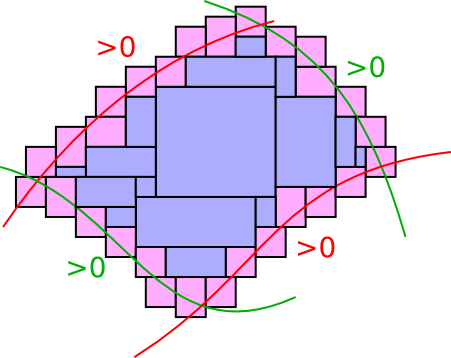

====================================
 Introduction
====================================

Ibex is a C++ numerical library based on **interval arithmetic** and **constraint programming**.

It can be used to solve a variety of problems that can roughly be formulated as:

  *Find a reliable characterization with boxes (Cartesian product of intervals) of sets implicitely defined by constraints*

*Reliable* means that all sources of uncertainty should be taken into account, including:

- approximation of real numbers by floating-point numbers
- round-off errors
- linearization truncatures
- model parameter uncertainty
- measurement noise

**Example of problem**: Given a set of nonlinear inequalities :math:`f_1\leq0,\ldots,f_n\leq0`, find two sets of boxes S\ :sub:`1` and S\ :sub:`2` such that

.. math::
   S_1\subseteq \{ x, f_1(x)\leq0 \wedge \ldots \wedge f_n(x)\leq0\}\subseteq S_2

The API
---------------

The API of Ibex can be broken into three layers:

- An extended (symbolic-numeric) interval calculator
- A contractor programming library
- A system solver / global optimizer (supplied as plugins since Release 2.2)

Each usage corresponds to a different layer and each layer is built on top of the previous one.

Ibex does not include low-level interval arithmetic but uses a third library (Ibex is currently 
automatically compiled either with `Gaol`_ or `Filib`_ , depending on your platform).

.. It can be compiled with different existing implementations such as `Gaol`_, `Filib`_ or `Profil/Bias`_. 
.. It can also be linked with different linear solvers, `Cplex`_, `Soplex`_ or `CLP`_.

.. _Gaol: http://sourceforge.net/projects/gaol
.. _Filib: http://www2.math.uni-wuppertal.de/~xsc/software/filib.html
.. _Profil/Bias: http://www.ti3.tu-harburg.de/keil/profil/index_e.html
.. _Cplex: http://www.ibm.com/software/commerce/optimization/cplex-optimizer
.. _Soplex: http://soplex.zib.de
.. _CLP: https://projects.coin-or.org/Clp

An extended interval calculator
-------------------------------

Ibex allows you to declare symbolically a mathematical function and to perform interval computations with it. For example::

  Variable x;
  Function f(x,sin(x)+1);

defines the "mathematical" object :math:`x \mapsto sin(x)+1`.

**Note:** *Functions* (as well as equalities or inequalities) can either be entered programmatically (using C++ operator overloading) or using a parser of an AMPL-like language called Minibex. Functions accept vector or matrix variables or values; similarities with Matlab are shared on purpose. See the modeling guide.

Now that functions are built, you can use them to perform interval or symbolic operations. Example::

  Interval x(0,1);
  Interval y=f.eval(x);            // calculate the image of x by f 
  Function df(f,Function::DIFF);   // derivate f
  Interval z=df.eval_affine(x);    // calculate the image of x by df using affine forms

All the classical operations with intervals can be performed with the previously defined functions, including relational (backward) operators, inner arithmetics, automatic differentiation, affine arithmetic, etc.

Contractor programming
-------------------------------

Ibex gives you the ability to build high-level interval-based algorithms declaratively through the *contractor programming* paradigm  :ref:`[Chabert & Jaulin, 2009] <Chabert09a>`.

A contractor is basically an operator that transforms a box to a smaller (included) box, by safely removing points with respect to some mathematical property.

The first property one usually wants to enforce is a numerical constraint, like an equation or inequality::

  Variable x,y,z;
  Function f(x,y,z,...);
  NumConstraint c(x,y,z,f(x,y,z)=0);
  CtcFwdBwd ctc(c); // build the contractor w.r.t f(x,y,z)=0

.. _contractor programming: http://www.emn.fr/z-info/gchabe08/quimper.pdf

Contraction is performed with a call to the function ``contract(...)``::

  IntervalVector box(3); // build a box for x, y and z
  box[0]=...; 
  box[1]=...; 
  box[2]=...; 
  ctc.contract(box); // contract the box

**Note**: A *contractor* is the equivalent of a propagator in finite domain solvers except that it is a pure numerical function (no state).

More complex properties are obtained by combining contractors. For instance::

  Ctc& c1=... ;
  Ctc& c2=... ;
  Ctc& c3=... ;
  CtcUnion u(CtcInter(c1,c2),c3);

will define the contractor :math:`((C_1 \cap C_2) \cup C_3))`.

Ibex contains a variety of built-in operators (HC4, Shaving, ACID, X-newton, q-intersection, etc.). 

System solving and global optimization
--------------------------------------

Finally, Ibex proposes various plugins. In particular, the IbexSolve and IbexOpt plugins are dedicated to system solving and optimization, and come both
with a default black-box solver and global optimizer for immediate usage. See the :ref:`IbexSolve <solver>` and :ref:`IbexOpt <optim>` documentations.

