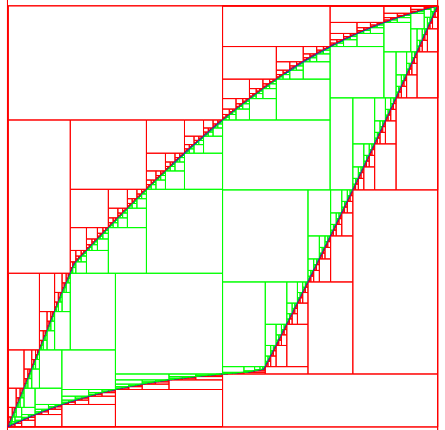
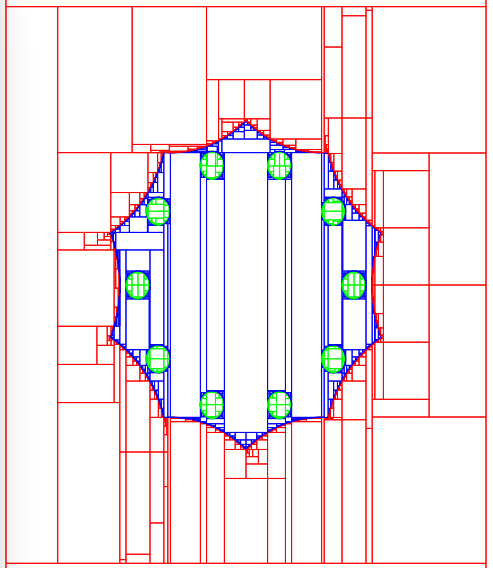

********************************
Do it Yourself!
********************************

The examples in this page are presented under the form of "labs" so that you can use them for practicing.

The complete source codes are available under the ``examples/`` folder.

In these labs, we use Vibes to plot boxes but you can easily adapt the code to
use your own graphical tool.

Fast instructions for installing and using Vibes are given :ref:`here <set-explore>`.

=====================
Set image
=====================

The complete code can be found here: ``examples/lab/lab1.cpp``.

**Introduction**

The goal of this first lab is to calculate the image of a box by a function using interval arithmetic:

If we denote by f the function and [x] the initial box, then the set S
to calculate is:

.. math::

   S := \{ f(x), x\in[x] \}.
   
Applying directly an :ref:`interval evaluation <tuto-func-eval>`
of the function f to [x] will give a single box that only represents an enclosure of S.

To fight with the wrapping effect, we will split [x] into smaller boxes and evaluate
the function with every little box as argument. This will result in a better description
of the set that will eventually converge to S as the size of the boxes tend to zero.

This will consist in three tasks:

- creating the function f
- creating the initial box [x] and splitting it into small boxes
- evaluating the function of every boxes
- plotting the results

**Question 1**

Create in the ``main`` the function

.. math::
   
   f:(x,y)\in\mathbb{R}^2\mapsto \begin{pmatrix}\sin(x+y)\\\cos(x+0.9\times y)\end{pmatrix}.
   
.. hidden-code-block:: cpp
   :label: show/hide solution
  
   Variable x,y;
   Function f(x,y,Return(sin(x+y),cos(x+0.9*y)));
		
**Question 2**

Create the box ([x],[y])=([0,6],[0,6]) and split each dimension into n slices, where n is a constant.

.. hidden-code-block:: cpp
   :label: show/hide solution

   IntervalVector box(2,Interval(0,6));

   // size of the "slice" on each dimension (x and y)
   double deltax=box[0].diam()/n;
   double deltay=box[1].diam()/n;

   for (int i=0; i<n; i++)
     for (int j=0; j<n; j++) {
       IntervalVector box2(2);
       box2[0]=Interval(box[0].lb()+i*deltax,box[0].lb()+(i+1)*deltax);
       box2[1]=Interval(box[1].lb()+j*deltay,box[1].lb()+(j+1)*deltay);
      
     }
   }
   
   
**Question 3**

Evaluate the function on each box and plot the result with Vibes.

.. hidden-code-block:: cpp
   :label: show/hide solution
   
   for ... 
     for ... {
       ...
       IntervalVector y=f.eval_vector(box2);
       // "b[b]" means that both the border and the interior of the box
       // is painted in blue
       vibes::drawBox(y[0].lb(), y[0].ub(), y[1].lb(), y[1].ub(), "b[b]");
     }
   }
   
   
**Question 4**

Compare the result with n=15, n=80 and n=500.

You should obtain the following pictures:

   +---------------------------------+-------------------------------+---------------------------------+
   | .. image:: images/lab1-15.png   | .. image:: images/lab1-80.png | .. image:: images/lab1-500.png  |
   |    :scale: 30%                  |    :scale: 30%                |    :scale: 30%                  |
   +---------------------------------+-------------------------------+---------------------------------+
   | n=15                            | n=80                          | n=500                           |
   +---------------------------------+-------------------------------+---------------------------------+
   
=====================
Set inversion (basic)
=====================

The complete code can be found here: ``examples/lab/lab2.cpp``.

**Introduction**

The goal of this lab is to program **Sivia** (*set inversion with interval analysis*) :ref:`[Jaulin & Walter 1993] <Jaulin93>` :ref:`[Jaulin 2001] <Jaulin01>`, an algorithm that draws a paving
representing a set E defined implicitely as the preimage of an interval [z] by a non-linear function :math:`f:\mathbb{R}^n\to\mathbb{R}` (here n=2).

.. math::
   E:=\{(x,y)\in\mathbb{R}^2, \ f(x,y)\in[z] \}.

.. figure:: images/sivia-basic.png
   :width: 300 px
   :align: center
   
   **Sivia (basic variant)**. *Result obtained with f(x,y)=sin(x+y)-0.1xy and [z]=[0,2], by simply alternating an evaluation and bisection phase. 
   For a precision of* :math:`\varepsilon=0.1`, *the number of boxes generated by the algorithm is* **11891**.

The Sivia algorithm performs a recursive exploration of the initial box by applying the following steps:

- **inner test**: if the image of ([x],[y]) by f is a subset of [z], the box is painted in green;

- **outer test**: if the image does not intersect [z], the box is painted in red;
  
- if none of these test succeeds and if ([x],[y]) has a maximal diameter greater than :math:`\varepsilon`, the box
  is split and the procedure is recursively called on the two subboxes.
  
**Question 1 (Initialisation)** 

Create the ``Function`` object that represents

.. math::
  (x,y)\mapsto \sin(x+y)-0.1\times x\times y.
  
and the initial bounding box ([-10,10],[-10,10]).

.. hidden-code-block:: cpp
   :label: show/hide solution

   	// Create the function we want to apply SIVIA on.
	Variable x,y;
	Function f(x,y,sin(x+y)-0.1*x*y);

	// Build the initial box
	IntervalVector box(2);
	box[0]=Interval(-10,10);
	box[1]=Interval(-10,10);

**Question 2 (Initialisation)** 

We shall use a `stack`_ for implementing the recursivity.
This stack is a container that will be used to store boxes.

Create a `C++ stack`_ and set the precision of bisection to 0.1.

Push the initial box in the stack. Define the image interval [z] and initialize it to [0,2].

.. _C++ stack: http://www.cplusplus.com/reference/stack/stack
.. _stack: http://en.wikipedia.org/wiki/Stack_%28abstract_data_type%29

.. hidden-code-block:: cpp
   :label: show/hide solution
   
   // Create a stack (for depth-first search)
   stack<IntervalVector> s;

   // Precision (boxes of size less than eps are not processed)
   double eps=0.1;

   // Push the initial box in the stack
   s.push(box);
   
   Interval z=Interval(0,2);

**Question 3**

Create the loop that pop boxes from the stack until it is empty.
Define a local variable ``box`` to be the current box (the one on top of the stack).

*Hint: use the top() and pop() functions of the* ``stack`` *class*.
  
.. hidden-code-block:: cpp
   :label: show/hide solution

   while (!s.empty()) {
     IntervalVector box=s.top();
     s.pop();
     ...
   }

**Question 4**

Implement the inner test (see above).
  
*Hint*: use :ref:`is_subset <itv-set-membership>`.

.. hidden-code-block:: cpp
   :label: show/hide solution

   while (!s.empty()) {
     IntervalVector box=s.top();
     s.pop();

     Interval fxy=f.eval(box);

     if (fxy.is_subset(z))
       vibes::drawBox(box[0].lb(), box[0].ub(), box[1].lb(), box[1].ub(), "k[g]");
     ...
   }
   
**Question 5**
 
Implement the outer test (see above).

*Hint*: use :ref:`intersects <itv-set-membership>`.

.. hidden-code-block:: cpp
   :label: show/hide solution

   while (!s.empty()) {
     ...
     else if (!fxy.intersects(z))
       vibes::drawBox(box[0].lb(), box[0].ub(), box[1].lb(), box[1].ub(), "k[r]");
     ...
   }
   
**Question 6**

If none of these test succeeds, split the box. We will split the box on the axis of its largest size.
Finally, the two subboxes are pushed on the stack.
  
*Hint*: use :ref:`extr_diam_index <itv-geom>` and :ref:`bisect <itv-bisect>`.

.. hidden-code-block:: cpp
   :label: show/hide solution

   while (!s.empty()) {
     ...  
     else if (box.max_diam()>eps) {
       // get the index of the dimension of maximal size (false stands for "max")
       int i=box.extr_diam_index(false);
       pair<IntervalVector,IntervalVector> p=box.bisect(i);
       s.push(p.first);
       s.push(p.second);
     }    
   }

==========================================
Set inversion (with contractors)
==========================================

The complete code can be found here: ``examples/lab/lab3.cpp``.

**Introduction**

We will improve the **Sivia** algorithm by replacing in the loop the inner and outer tests by contractions.
This leads to a more compact paving and a smaller number of boxes (see figure below).

The first part of the code is unchanged:

.. code-block:: cpp

   int main() {
     vibes::beginDrawing ();
     vibes::newFigure("lab3");

     // Create the function we want to apply SIVIA on.
     Variable x,y;
     Function f(x,y,sin(x+y)-0.1*x*y);

     // Build the initial box
     IntervalVector box(2);
     box[0]=Interval(-10,10);
     box[1]=Interval(-10,10);

     // Create a stack (for depth-first search)
     stack<IntervalVector> s;

     // Precision (boxes of size less than eps are not processed)
     double eps=0.1;

     // Push the initial box in the stack
     s.push(box);
     ...
     

The idea is to contract the current box either with respect to the constraint

.. math::
   f(x,y)\in[z],
   
in which case the contracted part will be painted in red, or

.. math::
   f(x)\not\in[z],

in which case the contracted part will be painted in green.

Given a contractor c, the contracted part is also called the *trace* of the contraction and is defined as :math:`[x]\backslash c([x])`.

.. figure:: images/sivia-full.png
   :width: 300 px
   :align: center
   
   **Sivia (with contractors)**. *Result obtained with f(x,y)=sin(x+y)-0.1xy and [z]=[0,2].
   For a precision of* :math:`\varepsilon=0.1`, *the number of boxes generated by the algorithm is* **5165**.

**Question 1**

Build forward-backward contractors for the four constraints (see :ref:`the tutorial <tuto-fwd-bwd>`):

.. math::
   f(x)<0, \quad f(x)\ge0, \quad f(x)\le2 \quad \mbox{and} \quad f(x)>2.

.. hidden-code-block:: cpp
   :label: show/hide solution

   NumConstraint c1(x,y,f(x,y)<=2);
   NumConstraint c2(x,y,f(x,y)>=0);
   NumConstraint c3(x,y,f(x,y)>2);
   NumConstraint c4(x,y,f(x,y)<0);

   // Create contractors with respect to each
   // of the previous constraints.
   CtcFwdBwd out1(c1);
   CtcFwdBwd out2(c2);
   CtcFwdBwd in1(c3);
   CtcFwdBwd in2(c4);
	
**Question 2**

Thanks to the :ref:`composition <tuto-inter-union-compo>`, build a contractor w.r.t. :math:`f(x)\in[0,2]`.

Similarly, thanks to the union, build a contractor w.r.t. :math:`f(x)\not\in[0,2]`.

.. hidden-code-block:: cpp
   :label: show/hide solution

   // Create a contractor that removes all the points
   // that do not satisfy either f(x,y)<=2 or f(x,y)>=0.
   // These points are "outside" of the solution set.
   CtcCompo outside(out1,out2);

   // Create a contractor that removes all the points
   // that do not satisfy both f(x,y)>2 or f(x,y)<0.
   // These points are "inside" the solution set.
   CtcUnion inside(in1,in2);

**Question 3**

Create the function ``contract_and_draw`` with the following signature:

.. code-block:: cpp

   void contract_and_draw(Ctc& c, IntervalVector& box, const char* color);

This function must contract the box ``box`` in argument with the contractor ``c`` and plot the trace of the contraction (see above) with Vibes,
with the specified color ``color``.

*Hints: use the* :ref:`diff <itv-diff>` *function of* ``IntervalVector`` *to calculate the set difference between two boxes.*
 

.. hidden-code-block:: cpp
   :label: show/hide solution
   
   void contract_and_draw(Ctc& c, IntervalVector& box, const char* color) {

     // Variables used to calculate the "diff" between 2 boxes and store the result.
     IntervalVector savebox=box;
     IntervalVector *result;

     c.contract(box);

     int n=savebox.diff(box,result);

     for (int i=0; i<n; i++) {
       vibes::drawBox(result[i][0].lb(), result[i][0].ub(), result[i][1].lb(), result[i][1].ub(), color);
     }

     delete[] result;
   }
   
**Question 4**

Replace in the loop the inner/outer tests by contractions.

.. hidden-code-block:: cpp
   :label: show/hide solution
   
   while (!s.empty()) {
     IntervalVector box=s.top();
     s.pop();
     contract_and_draw(outside, box, "k[r]");
     contract_and_draw(inside, box, "k[g]");
     if (!box.is_empty() && box.max_diam()>eps) {
     	int i=box.extr_diam_index(false);
     	pair<IntervalVector,IntervalVector> p=box.bisect(i);
     	s.push(p.first);
     	s.push(p.second);
     }
   }

.. _lab_set_inversion_sets:

==========================================
Set Inversion (using "Sets")
==========================================

The complete code can be found here: ``examples/lab/lab4.cpp``.

**Introduction**

The purpose of this exercice is just to get familiar with the structure proposed in Ibex
for representing sets (or pavings).

The set inversion is naturally one of the main features proposed in this part of the library.
We will solve the same problem as before but this time with the ``Set`` class directly.
This will take only a few lines of code.

Give first a look at the :ref:`documentation on sets <set>`.

**Question 1**

Create the function :math:`(x,y)\mapsto \sin(x+y)-0.1\times x\times y` and the
:ref:`forward-backward separator <sep-ctr>` associated to the constraint

.. math::
   0\le f(x,y) \le 2.
   
.. hidden-code-block:: cpp
   :label: show/hide solution
   
   	Function f("x","y","sin(x+y)-0.1*x*y");

	// Create a separator for 0<=f(x,y)<=2
	SepFwdBwd sep(f,Interval(0,2));
	
   
**Question 2**

Build the initial set [-10,10]x[-10,10] and contract it with the separator
with a precision of 0.1.

.. hidden-code-block:: cpp
   :label: show/hide solution

	// Build the initial set [-10,10]x[-10,10]
	Set set(IntervalVector(2,Interval(-10,10)));

	// Contract the set with the separator
	sep.contract(set,0.1);
   
**Question 3**

Plot the set with Vibes using a ``SetVisitor``.

Solution: copy-paste the code given :ref:`here <set-plot>`.

==========================================
Parameter Estimation
==========================================

The complete code can be found here: ``examples/lab/lab5.cpp``.

**Introduction**

This exercice is inspired by this `video`_.

.. _video: https://www.youtube.com/watch?v=Uq3VGMmRSXk&index=5&list=PLWjVweRFajXvmhiKdQKosUlqn9xLMx2YA

The problem is to find the values of two parameters :math:`(p_1,p_2)` of a physical process that are consistent with some measurements.
Measurements are subject to error and we want a garanteed enclosure of all the feasible parameters values.

The physical process is modeled by a function :math:`f_{p_1,p_2}:t\mapsto y` and a measurement is a couple of input-ouput :math:`(t_i,y_i)`.
We assume the input has no error. The error on the output is represented by an interval. 

The model is:

.. math::
  
   f_{p_1,p_2}:t \mapsto 20\exp(-p_1t)-8\exp(-p_2t).

We have the following series of measurements:

+---+--------------+
| t | y            |
+===+==============+
|1  | [4.5,7.5]    |
+---+--------------+
|2  | [0.67,4.6]   |
+---+--------------+
|3  | [-1,2.8]     |
+---+--------------+
|4  | [-1.7,1.7]   |
+---+--------------+
|5  | [-1.9,0.93]  |
+---+--------------+
|6  | [-1.8,0.5]   |
+---+--------------+
|7  | [-1.6,0.24]  |
+---+--------------+
|8  | [-1.4,0.09]  |
+---+--------------+
|9  | [-1.2,0.0089]|
+---+--------------+
|10 | [-1,-0.031]  |
+---+--------------+

**Question 1**

Build the function f as a mapping of 3 variables, p1, p2 and t.

.. hidden-code-block:: cpp
   :label: show/hide solution
   
   Function f("p1","p2","t","20*exp(-p_1*t)-8*exp(-p_2*t)");

**Question 2**

Build two interval vectors ``t`` and ``y`` of size 10 that contain the measurements data (even if the input has no error, we will enter times as 
degenerated intervals).

*Hint:* build interval vectors :ref:`from array of double <itv-vector-boxes>`.

.. hidden-code-block:: cpp
   :label: show/hide solution
   
   const int n=10;

   double _t[n][2] = {{1,1}, {2,2}, {3,3}, {4,4}, {5,5}, {6,6}, {7,7}, {8,8}, {9,9}, {10,10}};
   double _y[n][2] = {{4.5,7.5}, {0.67,4.6}, {-1,2.8}, {-1.7,1.7}, {-1.9,0.93}, {-1.8,0.5}, {-1.6,0.24}, {-1.4,0.09}, {-1.2,0.0089}, {-1,-0.031}};

   IntervalVector t(n,_t);
   IntervalVector y(n,_y);
	
**Question 3**

Build a system using a :ref:`system factory <mod-sys-cpp>`.
The system must contain the 10 constraints that represent each measurements and the additional bound constraints on the parameters:

.. math::

   0\le p_1\le 1, \quad 0\le p_2\le 1.
   
   
.. hidden-code-block:: cpp
   :label: show/hide solution
   
   	Variable p1,p2;
	SystemFactory fac;
	fac.add_var(p1);
	fac.add_var(p2);
	for (int i=0; i<n; i++)
		fac.add_ctr(f(p1,p2,t[i])=y[i]);

	// add bound constraints
	fac.add_ctr(p1>=0);
	fac.add_ctr(p1<=1);
	fac.add_ctr(p2>=0);
	fac.add_ctr(p2<=1);

	System sys(fac);

**Question 4**

Calculate the parameter values using set inversion (see :ref:`lab n°4 <lab_set_inversion_sets>`).
You should obtain the following picture:

.. hidden-code-block:: cpp
   :label: show/hide solution
   
   Set set(sys,0.001);

   ToVibes to_vibes(1);
   set.visit(to_vibes);

==========================================
Parameter Estimation (advanced)
==========================================

The complete code can be found here: ``examples/lab/lab6.cpp``.

**Introduction**

This lab is a follow-up of the previous one.

We now introduce uncertainty on the input variable t. However, we will try somehow to make our parameter
estimation *robust* with respect to this uncertainty. This means that the values of our parameters should
be consistent with our output whatever is the actual value of the input. Mathematically, we require 
p1 and p2 to respect the following constraints.

.. math::
   \forall i, \quad  \forall t\in[t_i], \quad f(p_1,p_2, t) \in [y_i].
   
As a contractor-oriented library, Ibex does not provide quantifiers at the modeling stage. This means that
you cannot write directly a constraint like this one. You have to build contractors and apply "quantifiers"
on contractors. Read the documentation about :ref:`contractors and quantifiers <ctc-quantif>`.

**Question 1**

Like in the previous lab, create the function and the vector of measurements.

.. hidden-code-block:: cpp
   :label: show/hide solution

   Function f("p1","p2","t","20*exp(-p1*t)-8*exp(-p2*t)");
   
   const int n=10;

   double _t[n][2] = {{1,1}, {2,2}, {3,3}, {4,4}, {5,5}, {6,6}, {7,7}, {8,8}, {9,9}, {10,10}};
   double _y[n][2] = {{4.5,7.5}, {0.67,4.6}, {-1,2.8}, {-1.7,1.7}, {-1.9,0.93}, {-1.8,0.5}, {-1.6,0.24}, {-1.4,0.09}, {-1.2,0.0089}, {-1,-0.031}};

   IntervalVector t(n,_t);
   IntervalVector y(n,_y);

Then, define a constant ``delta_t`` (the uncertainty on time) and :ref:`inflate <itv-geom>` the
vector of representing input times by this constant:

.. hidden-code-block:: cpp
   :label: show/hide solution

   double tdelta=0.1;
   t.inflate(tdelta);

**Question 2**

We will use the :ref:`generic constructor <ctc-quantif-generic>` of ``CtcForAll``.
Create a bitset that will indicate among the arguments of the function f which ones will be treated as variables
and which ones will be treated as quantified parameters.

.. hidden-code-block:: cpp
   :label: show/hide solution
   
   // Used to represent which variables are "quantified"
   BitSet vars(0,2,BitSet::empt);
   // add "p1" as variable
   vars.add(0);
   // add "p2" as variable
   vars.add(1);

**Question 3**

Create the inner and outer contractor for the "robust" parameter estimation problem.
Set the splitting precision :math:`\varepsilon` of the parameter to ``tdelta``/5.

*Hints: follow the same idea as in the contractor variant of set inversion* (see :ref:`lab n°3 <lab_set_inversion_sets>`).
*Also, we need here to deal with n inner/outer contractors. To perform the composition/union of several
contractors, see* :ref:`here <ctc-compo>`. 

.. hidden-code-block:: cpp
   :label: show/hide solution
   
   Array<Ctc> _c_out(n);
   Array<Ctc> _c_in(n);
   
   for (int i=0; i<n; i++) {
     IntervalVector ti(1,t[i]);
     c_out.set_ref(i,*new CtcForAll(*new CtcFwdBwd(f,y[i]),vars,ti,tdelta/5));
     c_in.set_ref(i,*new CtcExist(*new CtcNotIn(f,y[i]),vars,ti,tdelta/5));
   }

   CtcCompo c_out(_c_out);
   CtcUnion c_in(_c_in);

**Question 4**

- Create a :ref:`separator from the two contractors <sep-ctc-pair>`;
- Create a :ref:`set from the box <set-creation>` [0,1]x[0,1];
- :ref:`Contract the set <set-contract>` with the separator.

The pictures below show the results obtained for increasing values of ``deltat``
(0,0.1,0.2 and 0.3).
As expected, the larger the error on input, the smaller the set of feasible
parameters.

+--------------------------------------+--------------------------------------+--------------------------------------+--------------------------------------+
| .. figure:: images/param-estim-1.png | .. figure:: images/param-estim-2.png | .. figure:: images/param-estim-3.png | .. figure:: images/param-estim-4.png |
|   :width: 200 px                     |   :width: 200 px                     |   :width: 200 px                     |   :width: 200 px                     |
|   :align: center                     |   :align: center                     |   :align: center                     |   :align: center                     |
+--------------------------------------+--------------------------------------+--------------------------------------+--------------------------------------+
| deltat=0                             | deltat=0.1                           | deltat=0.2                           | deltat=0.3                           |
+--------------------------------------+--------------------------------------+--------------------------------------+--------------------------------------+
   

.. hidden-code-block:: cpp
   :label: show/hide solution

   SepCtcPair sep(c_in,c_out);
   
   Set set(IntervalVector(2,Interval(0,1)));
   
   sep.contract(set,eps);
   
==========================================
Stability
==========================================
 
The complete code can be found here: ``examples/lab/lab7.cpp``.

**Introduction**

The goal of this lab is to cast a classical problem in control theory into a set inversion problem.

We have a dynamical system y(t) governed by the following linear differential equation:

.. math::
   y^{(4)}(t)+a y^{(3)}(t)+b y^{(2)}(t)+(1-b) y'(t) + a y(t)=0.

where a and b are two unknown parameters.

Our goal is to find the set of couples (a,b) that makes the origin y=0 stable. It is depicted in the figure:

.. figure:: images/stability.png
   :width: 300 px
   :align: center
   
*Hint: apply the Routh-Hurwitz criterion to the caracteristic polynomial of the system.*
   
   
.. hidden-code-block:: cpp
   :label: show/hide solution

   double eps=0.001;

   Variable p,q;

   // The following function returns the first column
   // of the Routh table
   Function f(p,q,Return(p*q-(1-q),(p*q-(1-q))*(1-q)-pow(p,3)));

   // We require these coefficients to be all positive,
   // i.e., the image of f to be in [0,+oo)x[0,+oo)
   SepFwdBwd sep(f,IntervalVector(2,Interval::POS_REALS));

   // Build the initial box
   IntervalVector box(2);
   box[0]=Interval(0,2);
   box[1]=Interval(0,2);

   Set set(box);

   sep.contract(set,eps);
   
==========================================
Unstructured Mapping
==========================================

The complete code can be found here: ``examples/lab/lab8.cpp``.

**Introduction**

A robot is moving in a rectangular area [-L,L]x[-L,L] (with L=2) and tries to build a map
while avoiding obstacles. The map is precisely the shape of obstacles inside the area.

The only information we have is when its euclidian distance to an obstacle
get smaller than 0.9. It receives an alert, a vector of measurements which contain 
its own position (named ``x_rob`` and ``y_rob`` in the code)
and the position of the detected obstacle point
(named ``x_obs`` and ``y_obs`` in the code). We also know that 
all the points that are less distant than 0.1 from the detected point belong to the obstacle.

The robot has a series of n=10 measurements. The goal is to build an approximation
of the map using :ref:`set intervals <set-interval>`.

You can first copy-paste the data:

.. literalinclude:: ../examples/lab8.cpp
   :language: cpp
   :start-after: lab8-data
   :end-before:  lab8-data

   
.. hidden-code-block:: cpp
   :label: show/hide solution

   double eps=0.01;
   double L=2;

   // Distance function
   Variable x,y;
   Function dist(x,y,sqr(x)+sqr(y));

   // Build the initial box
   IntervalVector box(2,Interval(-L,L));

   // Create the initial i-set [emptyset,[box]]
   SetInterval set(box);

   for (int i=0; i<n; i++) {
      NumConstraint ctr1(x,y,sqr(x-x_rob[i])+sqr(y-y_rob[i])>=0.81);
      SepFwdBwd sep1(ctr1);
      sep1.contract(set,eps,MAYBE,NO);

      NumConstraint ctr2(x,y,sqr(x-x_obs[i])+sqr(y-y_obs[i])<=0.01);
      SepFwdBwd sep2(ctr2);
      sep2.contract(set,eps,YES,MAYBE);
   }
