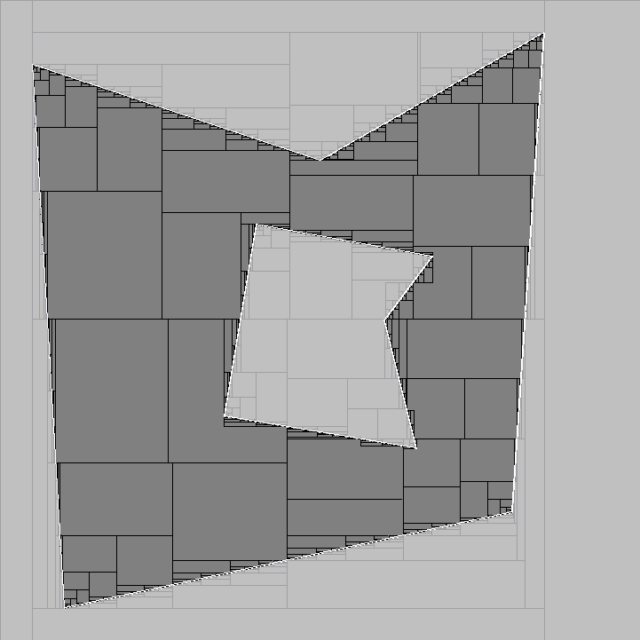

.. _sep:

**************************************************
             Separators
**************************************************

------------------------------
Introduction
------------------------------

A separator is an operator that performs two independent and
complementary contractions. The separator is associated with
a set (noted :math:`\mathcal{S}`) and the first contraction (called "inner")
removes points inside :math:`\mathcal{S}`. The second contraction (called
"outer") removes points outside S. See :ref:`[Jaulin & Desrochers 2014] <Jaulin14>`.

In concrete terms, given a box :math:`[\mathbf{x}]`, the separator produces two sub-boxes
:math:`[\mathbf{x}_{in}]` and :math:`[\mathbf{x}_{out}]` that verify:

.. math::

  \begin{array}{l}
  ([\mathbf{x}] \setminus [\mathbf{x}_{in}]) \subset S \\
  ([\mathbf{x}] \setminus [\mathbf{x}_{out}]) \cap S = \emptyset
  \end{array}

For efficiency reasons, the *separate(...)* function takes
two input-output arguments, <x_in> and <x_out>, each containing
initially a copy of the box :math:`[\mathbf{x}]`.

The first and more natural way to build a separator is to do it from a set implicitly defined by a constraint.
See :ref:`sep-ctr`.

Since a separator can be viewed a as pair of contractors, another natural way to build a separator is from two complementary contractors.
See :ref:`sep-ctc-pair`.

A separator is however not necessarily built this way.
A separator can also be built from a contractor and a predicate. In this case, the contractor is assumed to work with respect to the boundary of a set (that is, it removes both inner and outer points) and the predicate is assumed to state if a given box is either inside, outside or crossing the boundary of the same set. See :ref:`sep-boundary`.

.. _sep-ctr:

Separator from a constraint
~~~~~~~~~~~~~~~~~~~~~~~~~~~~~~~~~~~~~~~~~~~~

When the set :math:`\mathcal{S}` corresponds to an inequality f(x)<0, a separator with respect to the set :math:`\mathcal{S}` can therefore be automatically derived using forward / backward techniques for both contractions. This is what the ``SepFwdBwd`` class stands for.
The outer (resp. inner) contractor is simply a forward-backward with respect to f<0 (resp. f>=0).

.. literalinclude:: ../examples/doc-separator.cpp
   :language: cpp
   :start-after: sep-fwd-bwd-C
   :end-before:  sep-fwd-bwd-C

The result is:

.. literalinclude:: ../examples/doc-separator.txt
   :start-after:  sep-fwd-bwd-O
   :end-before:   sep-fwd-bwd-O

.. _sep-ctc-pair:

Separator from complementary contractors
~~~~~~~~~~~~~~~~~~~~~~~~~~~~~~~~~~~~~~~~~~~~
If two complementary contractors :math:`\mathcal{C}_{in}` and  :math:`\mathcal{C}_{out}` 
are available, the separator can build using the ``SepCtcPair`` class.

**(to be completed)**

.. code-block:: cpp

	Ctc c_in = ...
	Ctc c_out = ...
	// Build a separator from two complementary contractors
	SepCtcPair s(c_in, c_out);
    

.. _sep-boundary:

Boundary-Based Separator
~~~~~~~~~~~~~~~~~~~~~~~~~~~

Sometimes, we only have contractors with respect to the boundary of a set :math:`\mathcal{S}`. Isolating the inner and the outer contractor is not possible, or not easy. It is still possible to build a separator in this case, providing that we can also test whether a point belongs to the set or not. 

Let us consider a contractor C w.r.t. the boundary of a set :math:`\mathcal{S}`. The main idea behind the separator is, first, to contract the input box using C and, second, to test for each box in :math:`\neg C` if it belongs to :math:`\mathcal{S}` or not.

The test is performed for a given box by picking randomly one point and calling a *predicate*. A predicate is an object of a class extending ``Pdc``. It must implements a method ``test(IntervalVector&)`` that returns a boolean interval, that is, either ``YES``, ``NO`` or ``MAYBE`` (see ``BoolInterval``). In the case of a separator, the predicate must be an operator T such that:

.. math::
	\begin{array}{cccl}
		T: & \mathbb{IR}^n & \longrightarrow & \{yes, no, maybe\}\\
		&\mathbf{[x]} & \longmapsto & 
			\left\{
				\begin{array}{ll}
					yes & \text{ if } \mathbf{[x]} \subseteq \mathcal{S} \\
					no & \text{ if } \mathbf{[x]}\cap \mathcal{S}=\emptyset \\ 
                                        maybe & \text{otherwise}
				\end{array}
			\right.
	\end{array}	

A separator is built from a contractor and a predicate using the ``SepBoundaryCtc`` class.

**Note:** the predicate is called by ``SepBoundaryCtc`` only with points (degenerated boxes) but the interface for ``Pdc`` has been made to deal with a more general situation.

The :ref:`separator for the constraint "points in polygon" <sep-polygon>` is an illustraction of this type of separator.

As an illustration of the concept, we build here a separator for an inequality using ``SepBoundaryCtc``:

.. literalinclude:: ../examples/doc-separator.cpp
   :language: cpp
   :start-after: sep-boundary-C
   :end-before:  sep-boundary-C

The result is:

.. literalinclude:: ../examples/doc-separator.txt
   :start-after:  sep-boundary-O
   :end-before:   sep-boundary-O

---------------------------------
Separator Algebra
---------------------------------

The Separator algebra is a direct extension of the set algebra. 
E.g., the intersection of two separators w.r.t :math:`\mathcal{S}_1` and :math:`\mathcal{S}_2` 
is a separator w.r.t. :math:`\mathcal{S}_1\cap\mathcal{S}_2`.

Here are the available operations and the way they are performed. 
Separators are viewed as pair of contractors denoted :math:`\mathcal{S}_i = (\mathcal{S}_i^{in}, \mathcal{S}_i^{out})`.

.. math::
	\begin{array}{cccc}
	\overline{\mathcal{S}} & = & ( \mathcal{S}^{\text{out}},\mathcal{S}^{\text{in}} ) & \text{(Negation)} \\
	\mathcal{S}_{1}\cap \mathcal{S}_{2} & = & ( \mathcal{S}_{1}^{\text{in}%
	}\cup \mathcal{S}_{2}^{\text{in}},\mathcal{S}_{1}^{\text{out}}\cap \mathcal{S%
	}_{2}^{\text{out}})  & \text{(intersection)} \\ 
	\mathcal{S}_{1}\cup \mathcal{S}_{2} & = & ( \mathcal{S}_{1}^{\text{in}%
	}\cap \mathcal{S}_{2}^{\text{in}},\mathcal{S}_{1}^{\text{out}}\cup \mathcal{S%
	}_{2}^{\text{out}})  & \text{(union)} \\ 
	\bigcap\limits^{\{q\}}\mathcal{S}_{i} & = & (
	\bigcap\limits^{\{m-q-1\}}\mathcal{S}_{i}^{\text{in}},\bigcap\limits^{\{q%
	\}}\mathcal{S}_{i}^{\text{out}})  & \text{(relaxed intersection)} \\ 
	\mathcal{S}_{1}\setminus \mathcal{S}_{2} & = & \mathcal{S}_{1}\cap 
	\overline{\mathcal{S}_{2}}. & \text{(difference)}%
	\end{array}

The following example shows how to combine separator for finding the union and intersection of 3 rings.

**(to be completed)**

.. code-block:: cpp

    // define the center of circle
    double ax[] = {3,7,-3};
    double ay[] = {4,3,7};
    double dist[] = {3,6,6};

     Variable x,y;

     // Rings definitions
     Function f1(x,y,sqrt(sqr(x-ax[0]) + sqr(y-ay[0])));
     SepFwdBwd S1(f1,dist[0]);

     Function f2(x,y,sqrt(sqr(x-ax[1]) + sqr(y-ay[1])));
     SepFwdBwd S2(f2,dist[1]);

     Function f3(x,y,sqrt(sqr(x-ax[2]) + sqr(y-ay[2])));
     SepFwdBwd S3(f3,dist[2]);

     // Negation of separator
     SepNot S4(S3);

     // union of separators
     Array<Sep> AS(S1,S2,S3);
     SepUnion SUL = SepUnion(AS); 			// Union from an array of separators
     SepUnion SU2 = SepUnion(S1,S2);		// Union from two separators
     SepUnion SU3 = SepUnion(S1,S2,S3);

     // intersection of separators
     SepInter SIL = SepInter(AS);
     SepInter SI2 = SepInter(S1,S2);
     SepInter SI3 = SepInter(S1,S2,S4);

-------------------------------
Separator for a Polygon
-------------------------------

.. note::  

   This separator is avalaible in the ENSTA Robotics plugin (--with-ensta-robotics).
   

**(under construction)**

Contractor for a Segment
~~~~~~~~~~~~~~~~~~~~~~~~~~

The ``CtcSegment`` class allows to contract a box w.r.t. a segment (in the plane), that is, w.r.t. to the constraint

.. math::

  \mathbf{x}\in\left[\mathbf{a},\mathbf{b}\right]
 
where :math:`\mathbf{a}\in\mathbb{R}^2,\mathbf{b}\in\mathbb{R}^2`.

The contractor works by consider the following equivalent constraints :

.. math::

	\left\{ 
	\begin{array}{c}
	\det \left( \mathbf{b} - \mathbf{a}, \mathbf{a} - \mathbf{x}  \right) =0 \\
	\min \left( \mathbf{a},\mathbf{b}\right) \leq \mathbf{x}\leq \max \left( 
	\mathbf{a},\mathbf{b}\right) .%
	\end{array}%
	\right.

the *min* and the *max* being interpreted componentwise.

*Remark*: The first constraint is an equality :math:`\mathbf{f}(x) = 0` and the associated contractor will contract only on the boundary. We only have an approximation of :math:`\mathbb{X}^+` because there is no inner part.

.. _sep-polygon:

Point Inside a Polygon 
~~~~~~~~~~~~~~~~~~~~~~~~~~~~~~~~~~~~~~~~

We consider an oriented polygon :math:`\mathcal{P}`, convex or not, without self interaction, composed of N segments. The boundary :math:`\partial\mathcal{P}` of the polygon satisfies the following constraint:

.. math::

	\partial\mathcal{P} = \left\{ \mathbf{m} \in \mathbb{R}^2 ,\ 
		\exists i \in [\![1,N]\!], \mathbf{m} \in \left[\mathbf{a}_i, 
		\mathbf{b}_i \right]   \right\}

Let's us take  :math:`\mathcal{C}_{a_i,b_i}` as a contractor for the segment  :math:`\left[\mathbf{a_i},\mathbf{b_i}\right]`, the contractor for  :math:`\partial\mathcal{P}` is:

.. math::

	\mathcal{C}_{\partial\mathcal{P}} = \bigcup\limits^{N}_{i=1} \mathcal{C}_{a_i,b_i}

*Remark*: Because the union of minimal contractor is minimal, :math:`\mathcal{C}_{\partial\mathcal{P}}` is a minimal contractor for the border of the polygon :math:`\mathcal{P}`.

To identify which part is inside and outside we use a test based on the *Winding Number* which represents the total number of times that curve travels counterclockwise around the point. The winding number depends on the orientation of the curve, and is negative if the curve travels around the point clockwise.
Let us take a polygon :math:`\mathcal{P}` with vertices's :math:`V_1, V_2, \dots, V_n = V_1` and :math:`\mathbf{m}` a point not on the border of P. The Winding Number is defined by:

.. math::

	\mathbf{wn}(\mathbf{m},P) = \frac{1}{2\pi}\sum_{i=1}^{n}\theta_i = \frac{1}{2\pi}\sum_{i=1}^{n} \arccos\left(\frac{(V_i - 	\mathbf{m}).(V_{i+1}-\mathbf{m})}{\| (V_i - \mathbf{m})\| \|(V_{i+1} - \mathbf{m})\|}\right)

+--------------------------------------+------------------------------------------+
| *m is inside P*                      |  *m is outside P*                        |
|                                      |                                          |
| .. image:: images/T_PointInPoly.png  |  .. image:: images/T_PointOutPoly.png    |
|    :width: 300 px                    |     :width: 300 px                       |
|                                      |                                          |
+--------------------------------------+------------------------------------------+

So, if m is outside P we will have :math:`\mathbf{wn}(\mathbf{m},P) = 0`, otherwise if :math:`\mathbf{m}` is inside, :math:`\mathbf{wn}(\mathbf{m},P) = 1`.

The class implementing a separator for a polygon is ``SepPolygon``.

**(to be completed)**

Example
~~~~~~~~~~~~~~~~~~~~~~~~~~~~~

Let :math:`\mathcal{S}_P` be the polygon described in figure ... 

The following snippet shows how to build the associated separator and make operations with:

**(to be completed)**

.. code-block:: cpp
	
	// Polygone convex
	vector<double> walls_xa,walls_xb,walls_ya,walls_yb;

	walls_xa.push_back(6);  walls_ya.push_back(-6);   walls_xb.push_back(7);  walls_yb.push_back(9);
	walls_xa.push_back(7);  walls_ya.push_back(9);   walls_xb.push_back(0);  walls_yb.push_back(5);
	walls_xa.push_back(0);  walls_ya.push_back(5);    walls_xb.push_back(-9); walls_yb.push_back(8);
	walls_xa.push_back(-9); walls_ya.push_back(8);    walls_xb.push_back(-8); walls_yb.push_back(-9);
	walls_xa.push_back(-8); walls_ya.push_back(-9);   walls_xb.push_back(6);  walls_yb.push_back(-6);

	SepPolygon S1(walls_xa, walls_ya, walls_xb, walls_yb);

	// Make a hole inside the first one
	vector<double> walls_xa2,walls_xb2,walls_ya2,walls_yb2;
	walls_xa2.push_back(-2); walls_ya2.push_back(3);   walls_xb2.push_back(3.5);  walls_yb2.push_back(2);
	walls_xa2.push_back(3.5); walls_ya2.push_back(2);   walls_xb2.push_back(3);  walls_yb2.push_back(-4);
	walls_xa2.push_back(3); walls_ya2.push_back(-4);   walls_xb2.push_back(-3);  walls_yb2.push_back(-3);
	walls_xa2.push_back(-3); walls_ya2.push_back(-3);   walls_xb2.push_back(-2);  walls_yb2.push_back(3);

	SepPolygon S2(walls_xa2, walls_ya2, walls_xb2, walls_yb2);
	SepNot S3(S2);
	
	// Separator for the polygon with a hole in it
	SepInter S(S1, S3);

Using a paver, the previous separator will produce the following figure :

   *Point inside the polygon are in dark gray.*
