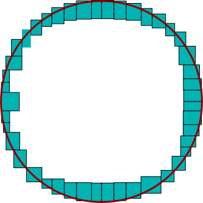
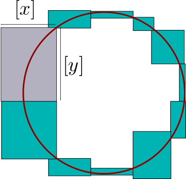
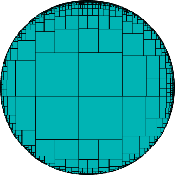
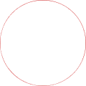
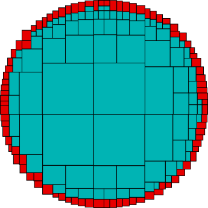
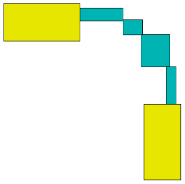
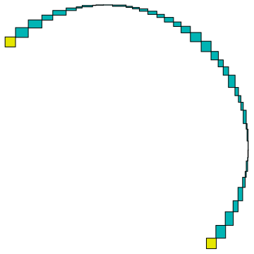

.. _solver: 

**************************************
             IbexSolve
**************************************

This documentation is for using IbexSolve with the command prompt.

To use IbexSolve in C++ or program your own solver with Ibex, see the :ref:`programmer guide <solver-prog>`.

.. _solver-intro:

============================
Getting started
============================

----------------------------
The very basic idea
----------------------------

IbexSolve solves systems of equation in a *complete* and *validated* way.

If you have an equation, say,

.. math::
	x^2=1

and you ask a traditional numerical algorithm to solve it, you will get an answer like:

.. math::
	x=0.999...
	
or maybe something close to the other root -1. But you will not get both roots
and you will not know exactly how far the returned value is from the actual root.

IbexSolve will give you the following answer:

.. math::
   x \in [-1.001,-0.999]  \quad \mbox{or} \quad x\in[0.999,1.001].
   
First, all solutions are returned: this is what we mean by *completeness*.

Second, each actual solution is rigorously enclosed in an interval:
this is what *validation* means.
 
.. _solver-intro_ex1:

------------------------------------
First example (well-constrained)
------------------------------------

Open a terminal (move to the ``bin`` subfolder if necessary) and run IbexSolve with, for example, the problem named `Kin1.bch` located at the specified path::

  ibexsolve [ibex-lib-path]/benchs/solver/non-polynom/Kin1.bch
	
After a short delay, the following result should be displayed::

 solving successful!

 number of solution boxes:	16
 number of boundary boxes:	--
 number of unknown boxes:	--
 number of pending boxes:	--
 cpu time used:			0.122523s
 number of cells:		47

You see that IbexSolve has found 16 solutions. To obtain the solutions, just run the same command with the option ``-s``. You will have each solution
displayed as a list of thin intervals enclosing the components of the true solution::

 solution n°1 = ([0.3999964622870867, 0.3999964622870879] ; [0.819005889921108, 0.8190058899211153] ; ...)

Also are reported here the CPU time (around a tenth of second in this case) and the number of "cells" required.
This number basically corresponds to the total number of hypothesis (bisections) that was required to solve the problem.
It gives an indication of its complexity. 

The file `Kin1.bch` is a plain text file, you can open it with any editor. You will see that it is a problem with 6 variables
and 6 non-linear constraints, with sine and cosine operators. The file is written in the :ref:`Minibex syntax <mod-minibex>`.

.. _solver-intro_ex2:

-------------------------------------
Second example (under-constrained) 
-------------------------------------

One important originality of IbexSolve (compared to the other interval tools) is that it is not limited to square (well-constrained) systems
as in the previous example.

Open your editor and type the following text in a `circle.mbx` file::

 variables
   x,y;
 
 constraints
   x^2+y^2=1;
 end

The solution set in this case is a full curve in the plane, the unit circle.

Then run IbexSolve to solve it::

  ibexsolve circle.mbx
 
You may expect to obtain a bunch of boxes in return enclosing the curve, like in the picture below
(we have superimposed the circle (in red) for clarity):

IbexSolve can calculate that. But this means that you expect a fine description of the curve and that you
accept to pay the inevitable price of a voluminous output (especially in higher dimension). 

A different and opposite strategy would be to expect in return a single box enclosing the curve,
that is, the square [0,1]x[0,1]. You would then have a minimal output but a very coarse description of the curve.

The default behavior of IbexSolve is somehow a best compromise between these two extreme strategies. It tries to 
return a minimal number of boxes while capturing the "topology" of the solution set.

In the circle example, IbexSolve will just produce 11 solutions. They are depicted below: 

   
As you can seen, the paving with the boxes is a rough description of the circle. Still, we see that the overall shape
is captured. This paving clearly looks differently than if we had solve, say, a linear equation.

In more precise terms, each *solution box* has the property to be crossed by the curve in a regular way.
Look for instance at the gray box. The curve makes no loop or u-turn whatsoever inside the box and crosses it
from side to side along the y-axis.

Formally, it is proven for this box that for all values y in [y] there exists x in [x], and a single one, 
such that (x,y) is a point of the curve. More exactly, we have:

.. math::
   \forall y\in\mathring{[y]} \quad \exists ! \ x\in\mathring{[x]} \quad x^2+y^2=1
   
where :math:`\mathring{\cdot}` stands for *the interior of*.

All the 11 boxes have this property except that the roles of x and y can be switched, depending whether the box is
more horizontal or vertical. This information is given in the :ref:`output data <solver-output>`.

Of course, all this generalizes to any dimension.

If you need to refine the paving, that is, to have boxes of smaller size, use for this the :ref:`eps-max parameter <solver-options-eps-max>`.
For instance, if we run IbexSolve using ``-E 0.5``  (or equivalently, ``--eps-max=0.5``) we obtain the following paving:

.. figure:: images/disc3-ibexsolve.svg
   :width: 300 px
   :align: center

.. _solver-intro_ex3:

--------------------------------
Third example (inequalities)
--------------------------------

Let us now turn to a single inequality. Just change the "=" sign of the previous example by "<="::
 
 variables
   x,y;
 
 constraints
   x^2+y^2<=1;
 end

Now the result is::

 number of solution boxes:	11629
 number of boundary boxes:	--
 number of unknown boxes:	8941
 number of pending boxes:	--
 cpu time used:			2.38774s
 number of cells:		41139

Below is the plot of all solution boxes (on the left), the plot of all unknown boxes (on the right). 

|solver-intro_ex3-pic1|   |solver-intro_ex3-pic2|

   
Here is a zoom on a fraction of unknown boxes:

|solver-intro_ex3-pic3|

This times, the solution boxes are all entirely inside the disk and the so-called unknown boxes enclose the boundary.

The choice of this terminology, and its consistency with the previous example, is justified :ref:`further <solver-output>`.

Just notice that the full disk is covered by the union of solution and unknown boxes.

It is possible to set the thickness of the boundary using the :ref:`eps-min parameter <solver-options-eps-min>`.

For instance, if you IbexSolve using ``-e 0.1`` (or equivalently, ``--eps-min=0.1``), you obtain:

---------------------
Scope and limits
---------------------
 
As illustrated by our previous examples, IbexSolve can solve any system of nonlinear equations and inequalities
in a complete and validated way, including underconstrained systems. 

All usual operators are allowed, including **trigonometric** functions but also **sign**, **absolute value** and **min/max** operators.

Furthermore, IbexSolve is a end-user program cooked by the ibex team, that resorts to
a unique black-box strategy (whatever the input problem is) and with a very limited 
number of parameters. Needless to say, this strategy is a kind of compromise and not the 
best one for a specific problem.

For programmers, the core library actually offers a :ref:`generic solver <solver-generic>`, a C++ class
that allows to easily build your own solver.

The main shortcoming of IbexSolve is that time is not bounded. This solver is not appropriate for online computations. 
You may typically expect some seconds or minutes of computing for small-scaled problems (less than
10 variables). But, beyond, it can takes hours or more.

.. _solver-output:

========================
The output of IbexSolve
========================

Let us first formally define what a system is. We call a **system** the given of 

1- *m* equations 

   .. math::

      \forall i\in\{1,\ldots,m\}, \quad f_i(x)=0

   or, in short, f(x)=0, with :math:`f:\mathbb{R}^n\to\mathbb{R}^m`. If *m=0* then :math:`\{1,\ldots,m\}=\emptyset` so the relation f(x)=0 becomes a tautology and can be omitted. 

2- *p* inequalities

   .. math::

      \forall i\in\{1,\ldots,p\}, \quad g_i(x)\leq0

   or, in short, g(x)<=0, with :math:`g:\mathbb{R}^n\to\mathbb{R}^p`. If *p=0* then g(x)<=0 is a tautology and can be omitted.

In the sequel:

- *n* will denote the number of variables
- *m* the number of equations (can be zero)
- *p* the number of inequalities (can be zero). 

We call *manifold* the set *M* of solution points of a given system.

IbexSolve produces 4 different types of boxes:

- the set *S* of *solution* boxes
- the set *B* of *boundary* boxes
- the set *U* of *unknown* boxes
- the set *P* of *pending* boxes

The first important property is that the manifold is covered by these sets:

.. math::
  
   M \subseteq S \cup B \cup U \cup P.    

The properties of each type of boxes are detailed right below and the :ref:`solver strategy <solver-strategy>` further.

.. _solver-output-solutions:

========================
Solution boxes
========================

In the case of a square system of equations, a solution box corresponds to the usual meaning, i.e., a box that is proved to contain a solution.

We shall give here a more general definition that also embraces the case of underconstrained systems.

In the general case, and as illustrated in the :ref:`circle example <solver-intro_ex2>`, the idea behind IbexSolve is to compute boxes that capture the local "topology" of the manifold.

More precisely, we consider a box as solution when there exists an homeomorphism between the part of the manifold enclosed by a box and the unit open ball 

.. math::

   B:=\{x \in\mathbb{R}^{n-m}, \|x\|<1\}.
   
So, [x] **is a solution** box only if:

.. math::
   \left\{\begin{array}{l}
   \forall x\in[x], \quad g(x)\leq 0\quad\mbox{and}\\
   \mathring{[x]}\cap M \quad \mbox{is homeomorphic to} \ B
   \end{array}\right.
   
where :math:`\mathring{[x]}` denotes the interior of [x]. Note that this definition imposes [x] to have a non-null radius on each of its components.

---------------------------
Parametrization
---------------------------

When IbexSolve finds a solution, it does not only supply the box but also give an information on how the homeomorphism can be built.
This is also illustrated with the gray box of our :ref:`circle example <solver-intro_ex2>` where, roughly speaking, one of the variable is identified as
the leading direction of the curve.

More generally, IbexSolve will give you a partition of the vector *x* into two subset of variables *u* (called *parameters*) and *v*.
The size of *u* is n-m and the size of *v* is m.

For simplicity, we assume that f(u,v) stands for f(x).

Now, this partition must be interpreted as follows.
First, because [x] (hence [u]) has a non-empty interior, there is an homeomorphism :math:`\phi_1:B\to\mathring{[u]}`.
Second, for every point *u\** in :math:`\mathring{[u]}` a (classical) Newton iteration applied to f(u\*,.)=0 starting for some
value *v* in [v] will converge to some v\* such that (u\*,v\*) is a point of M inside [x]. This is another homeomorphism :math:`\phi_2:\mathring{[u]}\to \mathring{[x]}\cap M`.

The sought homeomorphism is :math:`\varphi_1 \circ \varphi_2`.

This homeomorphism corresponds to the usual concept of *chart* and our partition gives indeed a local parametrization of the manifold. 
However, the parametrization involves a numerical algorithm (the Newton iteration) so it is only an implicit definition. 
But this makes sense from a practical standpoint. For instance, if one wants to plot the manifold, he/she knows that this
can be easily done by sampling values in the parameter vector and compute corresponding point using a Newton iteration.

In a sense, we can say that in a solution box the manifold is processable.

--------------------
Case of n=m 
--------------------

In the case of a well-constrained system (n=m), v=x and our definition of solution box boils down to

.. math::
   \exists ! \ x\in\mathring{[x]}, \quad f(x)=0,
  
so that our definition of solution box in this case exactly matches the usual meaning of "solution box" in the interval community.

--------------------
Case of n=0 
--------------------

In the case of a system without equation (m=0), u=x and our definition of solution box boils down to

.. math::
   \forall x\in[x], \quad g(x)\leq 0.

so that our definition of solution box in this case exactly matches the usual meaning of "inner box" in the interval community.

This explains why the solution boxes in our :ref:`introduction example <solver-intro_ex3>` are inside the disk.

.. _solver-output-boundary:

========================
Boundary boxes
========================

A boundary box intuitively corresponds to a box which intersects an inequality boundary. 
This should not be confused with the boundary of the manifold. For instance, in the circle example in introduction, there is no inequality hence no boundary box.

We may require additional properties on such boxes; for instance, that the inequality surface is not tangential to the boundary-free manifold f(x)=0. 
But checking such properties has a computational price. Sometimes, like in our :ref:`disk example <solver-intro_ex3>`, we have a large number of boundary boxes and we
prefer a weaker but cheaper boundary test.

For this reason, we have introduced in IbexSolve different boundary policies. The policy is set thanks to the ``--boundary`` option.

So far, the following policies exist:

- ``true`` : any box is considered as a boundary. This policy is set by default for under-constrained systems, see the :ref:`solver strategy <solver-strategy>`.
- ``false``: all boxes are considered as boundary.  This policy is set by default for inequalities, see the :ref:`solver strategy <solver-strategy>`.
- ``full-rank``: some inequalities are **potentially** active and the gradients of all constraints (equations and potentially activated inequalities) are linearly independent.

  This situation typically corresponds to *constraint qualification* in the realm of optimization. However, in the current state of development the inequality activation
  is not proved (we don't certify that f=0 and :math:`g_i=0` are simultaneously satisfied inside the box). This is still in development. 

- ``half-ball``: this option is not available yet. This policy means that the manifold inside the box is homeomorphic to the half-unit ball:
                 .. math::
                    B^+:=\{x \in\mathbb{R}^{n-m}, \|x\|<1, \|x_1\|\geq 0\}.
                 
  This is still in development.

.. _solver-output-unknown:

====================================
Unknown and pending boxes
====================================

The goal of IbexSolve is to describe a manifold with solution and boundary boxes. To this end, solution and boundary tests are used. These tests may however not apply on large boxes. Of course, one reason is that a large box may simply neither be a solution nor a boundary box. Another reason is that tests are just sufficient conditions. So the program splits recursively the initial box until one test succeeds. This leads to a classical binary search tree. 

However, it is frequent that no test will ever succeed in the vicinity of some points, whatever the size of the box is. This typically happens when f is singular. For this reason, the user has to fix a parameter value :math:`\varepsilon_{min}` to :ref:`stop bisection <solver-options-eps-min>`. This parameter allows to prevent bisecting again, although no test has succeeded yet. A box [x] is not split anymore if all the components of [x] has a radius smaller than :math:`\varepsilon_{min}`.	
    
But it is also possible to control the search by fixing some time limit T.

As said before, when the process terminates successfully, only solution and boundary boxes are issued. Otherwise, so-called unknown or pending boxes can appear, depending on the failure reason:

- If both the solution and boundary tests do not apply on a box which cannot be split anymore (the precision :math:`\varepsilon_{min}` being reached), the latter is classified as an unknown box. 

- If a box has not been processed because of the timeout, it is classified as a pending box. 

The two types of boxes are distinguished as their semantic is quite different: a pending box can potentially be successfully processed providing a longer time limit, or even within the same time limit using a different exploration strategy. On the contrary, an unknown box cannot be processed successfuly whatever the time limit is. The only way is by decreasing :math:`\varepsilon_{min}`.

.. _solver-strategy:

====================================
Solving strategy
====================================

The solving strategy depends on the type of systems

- **inequalities only** (m=0).
  For this type of systems,  IbexSolve will try to cover the manifold with either solution or boundary boxes, indifferently. We don't try
  to prioritize one type because they are not comparable. Indeed, solution boxes fully satisy inequalities g(x)<0 while boundary boxes crosses 
  g(x)=0. We may be more interested in either one. However, the default boundary policy is ``false``, which means that, by default, we prioritize
  solution boxes. In fact, we even refuse to consider a box as boundary with this policy which means that the paving will finely cover the
  manifold boundary with unknown boxes, as shown in our :ref:`disk example <solver-intro_ex3>`. Note that for this type of problems, the :ref:`eps-max parameter <solver-options-eps-max>` 
  applies to both boxes. 
  
- **under-constrained systems** (0<m<n).
  Note that this type of systems include at least one equality. IbexSolve will try to cover the manifold with as many solution boxes as possible.
  So it will bisect boxes until either a solution is found or the minimal precision :ref:`eps-min parameter <solver-options-eps-min>` is reached. 
  This is only at this point that the solver will try to eventually enforce a boundary test. And if it fails, the box is marked as *unknown*.
  So, for this type of problems, the :ref:`eps-max parameter <solver-options-eps-max>` does not apply to boundary boxes.
  The default boundary policy is ``true`` (no time wasted to check boundary property). 
  
- **well-constrained systems** (m=n).
  For this type of systems, we don't expect boundaries. If a solution of f(x)=0 also matches g(x)=0, the resulting box will be marked as *unknown*.
  In this case, the default boundary policy is ``false`` (no time wasted to check boundary property). The reason why it is not ``true`` as in the
  previous case is precisely because a boundary is now unexpected.

.. _solver-options:

================== 
Options
================== 

.. _solver-options-eps-min:

-----------------------
The eps-min parameter
-----------------------

This parameter basically allows to control the solution accuracy. 

It imposes the minimal width of validated boxes (boundary or solution) or, said differently, the maximal width of non-validated boxes.
So this is a criterion to *stop* bisection: a non-validated box will not be larger than :math:`\varepsilon_{min}`. 

Default value is 1e-3. 

.. _solver-options-eps-max:

-----------------------
The eps-max parameter 
-----------------------

This parameter is the maximal width of validated boxes (boundary or solution). So this is a criterion to *force* bisection: a
validated box will not be larger than :math:`\varepsilon_{max}` (unless there is no equality and it is fully inside inequalities). Default value is +oo (none).

The effect of the eps-max parameter is best illustrated in the case of pure inequalities, where solution and boundary boxes have equivalent roles (cf.
the :ref:`solver strategy <solver-strategy>`).

So let us get back again to our :ref:`disk example <solver-intro_ex3>`.

If we use the ``--boundary=true`` option, the program immediately stops with one boundary box. This is OK because the first box handled by the solver satisfies one of the criterion (either solution or boundary) and since :math:`\varepsilon_{max}` is set by default to +oo, the size of this box is less than :math:`\varepsilon_{max}`, so the search is over.

Now, if we set :math:`\varepsilon_{max}` to 1 we obtain graphically the following result:
            
.. figure:: images/disc6-ibexsolve.png
   :width: 300 px
   :align: center

Note that by setting the boundary policy to ``true``, no property at all is checked. This explains why the boundary boxes are bigger here than in the picture of 
the :ref:`circle example <solver-intro_ex2>`. Indeed, no bisection are required to enforce the boundary property. This is just governed by the :math:`\varepsilon_{max}` parameter.

If we run IbexSolve using ``-E 0.5``, we obtain:

.. figure:: images/disc7-ibexsolve.png
   :width: 300 px
   :align: center

and using ``-E 0.1``:

.. figure:: images/disc8-ibexsolve.png
   :width: 300 px
   :align: center

You can control this way the accuracy of the description. Of course, as before, the more accurate, the more boxes you have and the longer it takes.

In the case of a system with both equations and inequalities, the parameter
:math:`\varepsilon_{max}` will apply for both inner and boundary boxes.
If we consider now the following Minibex code::

  variables 
    x,y;

  constraints
    x^2+y^2=1;
    y+x>=0;
  end

we obtain the following figures by using decreasing values of :math:`\varepsilon_{max}` (namely 1, 0.5 and 0.1): 

|solver-options-eps-max-pic1|   |solver-options-eps-max-pic2|  |solver-options-eps-max-pic3|

.. |solver-options-eps-max-pic2| image:: images/disc10-ibexsolve.svg
   :width: 300 px
   

--------------
Overview
--------------

+--------------------------------------+------------------------------------------------------------------------------+
| -e<*float*>, --eps-min=<*float*>     | Minimal width of output boxes. This is a criterion to *stop* bisection: a    |
|                                      | non-validated box will not be larger than 'eps-min'. Default value is 1e-3.  |
|                                      |                                                                              |
+--------------------------------------+------------------------------------------------------------------------------+      
| -E<*float*>, --eps-max=<*float*>     | Maximal width of output boxes. This is a criterion to *force* bisection: a   |
|                                      | validated box will not be larger than 'eps-max' (unless there is no equality |
|                                      | and it is fully inside inequalities). Default value is +oo (none)            |
|                                      |                                                                              |
+--------------------------------------+------------------------------------------------------------------------------+
| -t<*float*>, --timeout=<*float*>     | Timeout (time in seconds). Default value is +oo (none).                      |
|                                      |                                                                              |
+--------------------------------------+------------------------------------------------------------------------------+
| --simpl=...                          | Expression simplification level. Possible values are:                        |
|                                      |                                                                              |
|                                      | - 0: no simplification at all (fast).                                        |
|                                      | - 1: basic simplifications (fairly fast).                                    |
|                                      |      E.g. x+1+1 --> x+2                                                      |
|                                      | - 2: more advanced simplifications without developing (can be slow).         |
|                                      |      E.g. x*x + x^2 --> 2x^2.                                                |
|                                      |      Note that the DAG structure can be lost.                                |
|                                      | - 3: simplifications with full polynomial developing (can blow up!).         |
|                                      |      E.g. x*(x-1) + x --> x^2.                                               |
|                                      |      Note that the DAG structure can be lost.                                |
|                                      |                                                                              |
|                                      | Default value is : 1.                                                        |
+--------------------------------------+------------------------------------------------------------------------------+
| -i<*filename*>, --input=<*filename*> | COV input file. The file contains a (intermediate) description of the        |
|                                      | manifold with boxes in the COV (binary) format.                              |
|                                      |                                                                              |
+--------------------------------------+------------------------------------------------------------------------------+      
| -o<*filename*>, --output=<*filename*>| COV output file. The file will contain the description of the manifold       |
|                                      | with boxes in the COV (binary) format.                                       |
|                                      |                                                                              |
+--------------------------------------+------------------------------------------------------------------------------+
| --format                             |  Give a description of the COV format used by IbexSolve                      |
+--------------------------------------+------------------------------------------------------------------------------+
| --bfs                                | Perform breadth-first search (instead of depth-first search, by default)     |
|                                      |                                                                              |
+--------------------------------------+------------------------------------------------------------------------------+
| --trace                              | Activate trace. "Solutions" (output boxes) are displayed as and when they    |
|                                      | are found.                                                                   |
|                                      |                                                                              |
+--------------------------------------+------------------------------------------------------------------------------+
| --stop-at-first                      |   Stop at first solution/boundary/unknown box found.                         |
+--------------------------------------+------------------------------------------------------------------------------+      
| --boundary=...                       | Boundary policy. Possible values are:                                        |        
|                                      |                                                                              |
|                                      | - ``true``: always satisfied. Set by default for under constrained problems  |
|                                      |   (0<m<n).                                                                   |
|                                      | - ``full-rank``: the gradients of all constraints (equations and potentially |
|                                      |   activated inequalities) must be linearly independent.                      |
|                                      | - ``half-ball``: (**not implemented yet**) the intersection of the box and   |
|                                      |   the solution set is homeomorphic to a half-ball of R^n                     |
|                                      | - ``false``: never satisfied. Set by default if m=0 or m=n (inequalities     |
|                                      |   only/square systems)                                                       | 
|                                      |                                                                              |
+--------------------------------------+------------------------------------------------------------------------------+
| -s, --sols                           | Display the "solutions" (output boxes) on the standard output.               |
|                                      |                                                                              |
+--------------------------------------+------------------------------------------------------------------------------+      
| --random-seed=<*float*>              | Random seed (useful for reproducibility). Default value is 1.                |
|                                      |                                                                              |
+--------------------------------------+------------------------------------------------------------------------------+
| -q, --quiet                          | Print no report on the standard output.                                      |
|                                      |                                                                              |
+--------------------------------------+------------------------------------------------------------------------------+
| --forced-params=<*string*>           | Force some variables to be parameters in the parametric proofs, separated by |
|                                      | '+'. Example: --forced-params=x+y                                            |
|                                      |                                                                              |
+--------------------------------------+------------------------------------------------------------------------------+      
