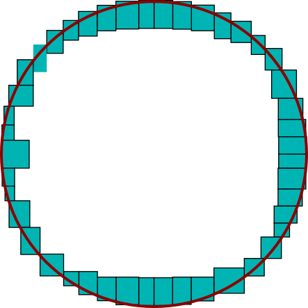
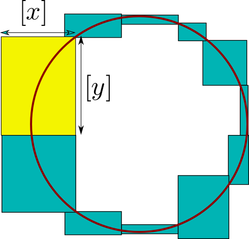

.. _solver: 

**************************************
             IbexSolve
**************************************

.. _solver-intro:

============================
Getting started
============================

----------------------------
The very basic idea
----------------------------

Ibexsolve solves systems of equation in a *complete* and *validated* way.

If you have an equation, say,

.. math::
	x^2=1

and you ask a traditional numerical algorithm to solve it, you will get an answer like:

.. math::
	x=0.999...
	
or maybe something close to the other root -1. But you will not get both roots
and you will not know exactly how far the returned value is from the actual root.

IbexSolve will give you the following answer:

.. math::
   x \in [-1.001,-0.999]  \quad \mbox{or} \quad x\in[0.999,1.001].
   
First, all solutions are returned: this is what we mean by *completeness*.

Second, each actual solution is rigorously enclosed in an interval:
this is what *validation* means.
 
.. _solver-intro_ex1:

------------------------------------
First example (well-constrained)
------------------------------------

Open a terminal (move to the ``bin`` subfolder if necessary) and run IbexSolve with, for example, the problem named `Kin1.bch` located at the specified path::

  ibexsolve [ibex-lib-path]/benchs/solver/non-polynom/Kin1.bch
	
After a short delay, the following result should be displayed::

 solving successful!

 number of solution boxes:	16
 number of boundary boxes:	--
 number of unknown boxes:	--
 number of pending boxes:	--
 cpu time used:			0.122523s
 number of cells:		47

You see that IbexSolve has found 16 solutions. To obtain the solutions, just run the same command with the option ``-s``. You will have each solution
displayed as a list of thin intervals enclosing the components of the true solution::

 solution n°1 = ([0.3999964622870867, 0.3999964622870879] ; [0.819005889921108, 0.8190058899211153] ; ...)

Also are reported here the CPU time (around a tenth of second in this case) and the number of "cells" required.
This number basically corresponds to the total number of hypothesis (bisections) that was required to solve the problem.
It gives an indication of its complexity. 

The file `Kin1.bch` is a plain text file, you can open it with any editor. You will see that it is a problem with 6 variables
and 6 non-linear constraints, with sine and cosine operators. The file is written in the :ref:`Minibex syntax <mod-minibex>`.

.. _solver-intro_ex2:

-------------------------------------
Second example (under-constrained) 
-------------------------------------

One important originality of IbexSolve (compared to the other interval tools) is that it is not limited to square (well-constrained) systems
as in the previous example.

Open your editor and type the following text in a `circle.mbx` file::

 variables
   x,y;
 
 constraints
   x^2+y^2=1;
 end

The solution set in this case is a full curve in the plane, the unit circle.

Then run ``ibexsolve`` to solve it::

  ibexsolve circle.mbx
 
You may expect to obtain a bunch of boxes in return enclosing the curve, like in the picture below
(we have superimposed the circle (in red) for clarity):

Ibexsolve can calculate that. But this means that you expect a fine description of the curve and that you
accept to pay the inevitable price of a voluminous output (especially in higher dimension). 

A different and opposite strategy would be to expect in return a single box enclosing the curve,
that is, the square [0,1]x[0,1]. You would then have a minimal output but a very coarse description of the curve.

The default behavior of ``ibexsolve`` is somehow a best compromise between these two extreme strategies. It tries to 
return a minimal number of boxes while capturing the "topology" of the solution set.

In the circle example, ``ibexsolve`` will just produce 11 solutions. They are depicted below: 

   
As you can seen, the paving with the boxes is a rough description of the circle. Still, we see that the overall shape
is captured. This paving clearly looks differently than if we had solve, say, a linear equation.

In more precise terms, each *solution box* has the proprety to be crossed by the curve in a regular way.
Look for instance at the yellow box. The curve makes no loop or u-turn whatsoever inside the box and crosses it
from side to side along the y-axis.

Formally, it is proven for this box that for all value of y in [y] there exists x in [x], and a single one, 
such that (x,y) is a point of the curve.

All the 11 boxes have this property except that the roles of x and y can be switched, depending whether the box is
more horizontal or vertical. This information is given in the :ref:`output data <solver-output>`.

Of course, all this generalizes to any dimension.

.. _solver-intro_ex3:

--------------------------------
Third example (inequalities)
--------------------------------

---------------------
Scope and limits
---------------------
 
As illustrated by our previous examples, Ibexsolve can solve any system of nonlinear equations and inequalities
in a complete and validated way, including underconstrained systems. 

All usual operators are allowed, including **trigonometric** functions but also **sign**, **absolute value** and **min/max** operators.

Furthermore, ``ibexsolve`` is a end-user program cooked by the ibex team, that resorts to
a unique black-box strategy (whatever the input problem is) and with a very limited 
number of parameters. Needless to say, this strategy is a kind of compromise and not the 
best one for a specific problem.

For ibex programers, the core library actually offers a :ref:`generic solver <solver-generic>`, a C++ class
that allows to easily build your own solver.

The main shortcoming of ``ibexsolve`` is that time is not bounded. This solver is not appropriate for online computations. 
You may typically expect some seconds or minutes of computing for small-scaled problems (less than
10 variables). But, beyond, it can takes hours or more.

.. _solver-output:

========================
The output of IbexSolve
========================

Let us first formally define what a system is. We call a **system** the given of 

1- *m* equations 

   .. math::

      \forall i\in\{1,\ldots,m\}, \quad f_i(x)=0

   or, in short, f(x)=0, with :math:`f:\mathbb{R}^n\to\mathbb{R}^m`. If *m=0* then :math:`\{1,\ldots,m\}=\emptyset` so the relation f(x)=0 becomes a tautology and can be omitted. 

2- *p* inequalities

   .. math::

      \forall i\in\{1,\ldots,p\}, \quad g_i(x)\leq0

   or, in short, g(x)<=0, with :math:`g:\mathbb{R}^n\to\mathbb{R}^p`. If *p=0* then g(x)=<0 is a tautology and can be omitted.

In the sequel:

- *n* will denote the number of variables
- *m* the number of equalities (can be zero)
- *p* the number of inequalities (can be zero). 

We call *manifold* the set *M* of solution points of a given system.

Ibexsolve produces 4 different types of boxes:

- the set *S* of *solution* boxes
- the set *B* of *boundary* boxes
- the set *U* of *unknown* boxes
- the set *P* of *pending* boxes

The first important property is that the manifold is covered by these sets:

.. math::
  
   M \subseteq S \cup B \cup U \cup P.    

.. _solver-output-solutions:

---------------------
Solution boxes
---------------------

In the case of a square system of equations, a solution box corresponds to the usual meaning, i.e., a box that is proved to contain a solution.

We shall give here a more general definition that also embraces the case of underconstrained systems.

In the general case, and as illustrated in the :ref:`circle example <solver-intro_ex2>`, the idea behing ``ibexsolve`` is to compute boxes that capture the local "topology" of the manifold.

More precisely, we consider a box as solution when there exists an homemorphism between the part of the manifold enclosed by a box and the unit open ball 

.. math::

   B:=\{x \in\mathbb{R}^{n-m}, \|x\|<1\}.
   
So, [x] **is a solution** box only if:

.. math::
   \left\{\begin{array}{l}
   \forall x\in[x], \quad g(x)\leq 0\quad\mbox{and}\\
   \mathring{[x]}\cap M \quad \mbox{is homeomorphic to} \ B
   \end{array}\right.
   
where :math:`\mathring{[x]}` denotes the interior of [x]. Note that this definition imposes [x] to have a non-null radius on each of its components.

When ``ibexsolve`` finds a solution, it does not only supply the box but also gives an information on how the homeomorphism can be built.
This is also illustrated with the yellow box of our :ref:`circle example <solver-intro_ex2>` where, roughly speaking, one of the variable is identified as
the leading direction of the curve.

More generally, ``ibexsolve`` will give you a partition of the vector *x* into two subset of variables *u* (called *parameters*) and *v*.
The size of *u* is n-m and the size of *v* is m. So, if *m=0*, then u=x and if *m=n*, v=x.

For simplicity, we assume that f(u,v) stands for f(x).

Now, this partition must be interpreted as follows.
First, because [x] (hence [u]) has a non-empty interior, there is an homeomorphism :math:`\phi_1:B\to\mathring{[u]}`.
Second, for every point *u* in :math:`\mathring{[u]}` a (classical) Newton iteration applied to f(u,.)=0 starting for some
value *v* in [v] will converge to a point in M inside [x]. This is another homeomorphism :math:`\phi_2:\mathring{[u]}\to \mathring{[x]}\cap M`.

The sought homeomorphism is :math:`\varphi_1 \circ \varphi_2`.

This homeomorphism corresponds to the usual concept of *chart* and our partition gives indeed a local parametrization of the manifold. 
However, the parametrization involves a numerical algorithm (the Newton iteration) so it is only an implicit definition. 
But this makes sense in a practical standpoint. For instance, if one wants to plot the manifold, he/she knows that this
can be easily done by sampling values in the parameter vector and compute corresponding point using a Newton iteration.

So, in a solution box, we can say that the manifold is processable.

.. _solver-output-boundary:

---------------------
Boundary boxes
---------------------

A boundary box corresponds to the case of a box which satisfies the regularity condition of a solution, but which crosses one inequality.

.. _solver-output-unknown:

-----------------------------
Unknown and pending boxes
-----------------------------

The goal of ``ibexsolve`` is to describe a manifold with solution and boundary boxes. To this end, solution and boundary tests are used. These tests may however not apply on large boxes. Of course, one reason is that a large box may simply neither be a solution nor a boundary box. Another reason is that tests are just sufficient conditions. So the program splits recursively the initial box until one test succeeds. This leads to a classical binary search tree. 

However, it is frequent that no test will ever succeed in the vicinity of some points, whatever the size of the box is. This typically happens when f is singular. For this reason, the user has to fix a parameter value  :math:`\varepsilon_{min}` to :ref:`stop bisection <solver-options-eps-min>`. This parameter allows to prevent bisecting again, although no test has succeeded yet. A box [x] is not split anymore if all the components of [x] has a radius smaller than :math:`\varepsilon_{min}`.
    
But it is also possible to control the search by fixing some time limit T.

As said before, when the process terminates successfully, only solution and boundary boxes are issued. Otherwise, so-called unknown or pending boxes can appear, depending on the failure reason:

- If both the solution and boundary tests do not apply on a box which cannot be split anymore (the precision :math:`\varepsilon_{min}` being reached), the latter is classified as an unknown box. 

- If a box has not been processed because of the timeout, it is classified as a pending box. 

The two types of boxes are distinguished as their semantic is quite different: a pending box can potentially be successfully processed providing a longer time limit, or even within the same time limit using a different exploration strategy. On the contrary, an unknown box cannot be processed successfuly whatever the time limit is. The only way is by decreasing :math:`\varepsilon_{min}`.

.. _solver-options:

================== 
Options
================== 

.. _solver-options-eps-min:

---------------------
Solution Accuracy 
---------------------

You can control the solution accuracy. This

This may allow, for allow boxes to be large, as long as they .

--------------
Overview
--------------

+--------------------------------------+------------------------------------------------------------------------------+
| -e<*float*>, --eps-min=<*float*>     | Minimal width of output boxes. This is a criterion to *stop* bisection: a    |
|                                      | non-validated box will not be larger than 'eps-min'. Default value is 1e-3.  |
|                                      |                                                                              |
+--------------------------------------+------------------------------------------------------------------------------+      
| -E<*float*>, --eps-max=<*float*>     | Maximal width of output boxes. This is a criterion to *force* bisection: a   |
|                                      | validated box will not be larger than 'eps-max' (unless there is no equality |
|                                      | and it is fully inside inequalities). Default value is +oo (none)            |
|                                      |                                                                              |
+--------------------------------------+------------------------------------------------------------------------------+
| -t<*float*>, --timeout=<*float*>     | Timeout (time in seconds). Default value is +oo (none).                      |
|                                      |                                                                              |
+--------------------------------------+------------------------------------------------------------------------------+
| --simpl=...                          | Expression simplification level. Possible values are:                        |
|                                      |                                                                              |
|                                      | - 0: no simplification at all (fast).                                        |
|                                      | - 1: basic simplifications (fairly fast).                                    |
|                                      |      E.g. x+1+1 --> x+2                                                      |
|                                      | - 2: more advanced simplifications without developing (can be slow).         |
|                                      |      E.g. x*x + x^2 --> 2x^2.                                                |
|                                      |      Note that the DAG structure can be lost.                                |
|                                      | - 3: simplifications with full polynomial developing (can blow up!).         |
|                                      |      E.g. x*(x-1) + x --> x^2.                                               |
|                                      |      Note that the DAG structure can be lost.                                |
|                                      |                                                                              |
|                                      | Default value is : 1.                                                        |
+--------------------------------------+------------------------------------------------------------------------------+
| -i<*filename*>, --input=<*filename*> | COV input file. The file contains a (intermediate) description of the        |
|                                      | manifold with boxes in the COV (binary) format.                              |
|                                      |                                                                              |
+--------------------------------------+------------------------------------------------------------------------------+      
| -o<*filename*>, --output=<*filename*>| COV output file. The file will contain the description of the manifold       |
|                                      | with boxes in the COV (binary) format.                                       |
|                                      |                                                                              |
+--------------------------------------+------------------------------------------------------------------------------+
| --format                             |  Give a description of the COV format used by IbexSolve                      |
+--------------------------------------+------------------------------------------------------------------------------+
| --bfs                                | Perform breadth-first search (instead of depth-first search, by default)     |
|                                      |                                                                              |
+--------------------------------------+------------------------------------------------------------------------------+
| --trace                              | Activate trace. "Solutions" (output boxes) are displayed as and when they    |
|                                      | are found.                                                                   |
|                                      |                                                                              |
+--------------------------------------+------------------------------------------------------------------------------+
| --stop-at-first                      |   Stop at first solution/boundary/unknown box found.                         |
+--------------------------------------+------------------------------------------------------------------------------+      
| --boundary=...                       | Boundary test strength. Possible values are:                                 |        
|                                      |                                                                              |
|                                      | - ``true``: always satisfied. Set by default for under constrained problems  |
|                                      |   (0<m<n).                                                                   |
|                                      | - ``full-rank``: the gradients of all constraints (equalities and potentially|
|                                      |   activated inequalities) must be linearly independent.                      |
|                                      | - ``half-ball``: (**not implemented yet**) the intersection of the box and   |
|                                      |   the solution set is homeomorphic to a half-ball of R^n                     |
|                                      | - ``false``: never satisfied. Set by default if m=0 or m=n (inequalities     |
|                                      |   only/square systems)                                                       | 
|                                      |                                                                              |
+--------------------------------------+------------------------------------------------------------------------------+
| -s, --sols                           | Display the "solutions" (output boxes) on the standard output.               |
|                                      |                                                                              |
+--------------------------------------+------------------------------------------------------------------------------+      
| --random-seed=<*float*>              | Random seed (useful for reproducibility). Default value is 1.                |
|                                      |                                                                              |
+--------------------------------------+------------------------------------------------------------------------------+
| -q, --quiet                          | Print no report on the standard output.                                      |
|                                      |                                                                              |
+--------------------------------------+------------------------------------------------------------------------------+
| --forced-params=<*string*>           | Force some variables to be parameters in the parametric proofs, separated by |
|                                      | '+'. Example: --forced-params=x+y                                            |
|                                      |                                                                              |
+--------------------------------------+------------------------------------------------------------------------------+      

================== 
Programers guide
================== 

.. _solver-call-default:

-------------------------------
Calling IbexSolve from C++
-------------------------------

You can call IbexSolve (the default solver) and get the solutions from C++.

Two objects must be built: the first represents the problem (namely, a :ref:`system <mod-sys>`), the second
the solver itself. Then, we just run the solver. Here is a simple example:

.. literalinclude:: ../examples/doc-solver.cpp
   :language: cpp
   :start-after: solver-call-default-C
   :end-before: solver-call-default-C
 
The output is:

.. literalinclude:: ../examples/doc-solver.txt
   :start-after: solver-call-default-O
   :end-before: solver-call-default-O

.. _solver-generic:
  
-------------------------------
The generic solver
-------------------------------

The generic solver is the main C++ class behind the implementation of ``ibexsolve``.
It is a classical branch and prune algorithm that interleaves contraction and branching (bisection) until
boxes get sufficiently small. However, it performs a more general task that just finding solution points of square
systems of equations: it also knows how to deal with under-constrained systems and handle manifolds. 

Compared to ``ibexsolve``, the generic solver allows the following additional operators as inputs:

#. a **contractor** 
       
    Operator that contracts boxes by removing non-solution points. The contraction operator must be compatible with the 
    system given (equations/inequalities). The solver performs no check (it is the user responsability). See
    :ref:`ctc`.

#. a **bisector**           

    Operator that splits a box. Note that some bisectors have a *precision* parameter: the box is bisected providing 
    it is large enough. But this precision is not directly seen by the solver which has its own precision variables 
    (see ``-e`̀  and ``-E``). If however the bisector does not split a box, this will generate an exception caught by the solver,
    which will not continue the search and backtrack. So fixing the bisector internal precision gives basically the same effect
    as fixing it with ``--e``. See :ref:`strategy-bisectors` for more details. 

#. a **cell buffer**
  
    Operator that manages the list of pending boxes (a *cell* is a box with a little bit of extra information used by the search).
    See :ref:`strategy-cell-buffers` for more details.

Our next example creates a solver for the intersection of two circles of radius :math:`d`, 
one centered on :math:`(0,0)` and the other in :math:`(1,0)`. 

To this end we first create a vector-valued function:

.. math::
	(x,y) \mapsto \begin{pmatrix} x^2+y^2-d \\ (x-1)^2+y^2-d \end{pmatrix}

Then, we build two contractors; a :ref:`forward-bacwkard <ctc-fwd-bwd>` contractor and (because the system is square),
an :ref:`interval Newton <tuto-newton>` contractor.		

We chose as bisection operator the *round-robin* operator, that splits each component in turn.
The precision of the solver is set to 1e-7.

Finally, the cell buffer is a stack, which leads to a depth-first search.

.. literalinclude:: ../examples/doc-solver.cpp 
   :language: cpp
   :start-after: solver-solver-generic-C
   :end-before: solver-solver-generic-C

The output is:

.. literalinclude:: ../examples/doc-solver.txt
   :start-after: solver-generic-O
   :end-before: solver-solver-generic-O

.. _solver-implem-default:

--------------------------------------------------------------
Implementing IbexSolve (the default solver)
--------------------------------------------------------------

IbexSolve is an instance of the generic solver with (almost) all parameters set by default.

We already showed how to `Calling IbexSolve from C++`_.
To give a further insight into the generic solver and its possible settings, we explain now how to re-create the default solver 
by yourself.

The contractor of the default solver is obtained with the following receipe.
This is a :ref:`composition <tuto-inter-union-compo>` of

#. :ref:`ctc-HC4`
#. :ref:`ACID <ctc-acid>`
#. :ref:`Interval Newton <tuto-newton>` (only if it is a square system of equations)
#. A :ref:`fixpoint <tuto-fixpoint>` of the :ref:`ctc-polytope-hull` of two linear relaxations combined:
    - the relaxation called X-Taylor;
    - the relaxation generated by affine arithmetic. See :ref:`ctc-linear-relax`.
   
The bisector is based on the :ref:`strategy-smear-function` with maximal relative impact.

So the following program exactly reproduces the default solver.

.. literalinclude:: ../examples/doc-solver.cpp 
   :language: cpp
   :start-after: solver-implem-default-C
   :end-before: solver-implem-default-C
   
.. _solver-parallel:

-------------------------------
Parallelizing search
-------------------------------

It is possible to parallelize the search by running (in parallel) solvers for different subboxes of the initial box.

Be aware however that Ibex has not been designed (so far) to be parallelized and the following lines only reports our preliminary
experiments.

Here are the important observations:

- The sub-library gaol is **not** thread-safe. You must compile Ibex with **filib** which seems to be OK (see :ref:`install-options`).
- The linear solver Soplex (we have not tested yet with Cplex) seems to be thread-safe but sometimes generates error messages on the
  console like::

	    ISOLVE56 stop: 0, basis status: PRIMAL (2), solver status: RUNNING (-1)

  So, calling Soplex several times simultaneously seems not to be allowed, but Soplex at least manages the case properly, that is,
  stops. As far as we have observed, we don't lose solutions even when this kind of message appear. 
- Ibex objects are not thread-safe which means that the solvers run in parallel must share no information. In particular,
  each solver must have its **own copy** of the system.

Here is an example:

.. literalinclude:: ../examples/doc-solver.cpp
   :language: cpp
   :start-after: solver-parallel-C-1
   :end-before:  solver-parallel-C-1

If I remove the ``#pragma`` the program displays::

  solver #1 found 64
  solver #2 found 64

  real	0m5.121s        // <-------- total time
  user	0m5.088s

With the ``#pragma``, I obtain::

  solver #1 found 64
  solver #2 found 64

  real	0m2.902s        // <-------- total time
  user	0m5.468s

**Note:** It is pure luck that by bisecting the 4th variable, we obtain exactly half of the solutions on each sub-box.
Also, looking for the 64 first solutions takes here around the same time than looking for the 64 subsequent ones, which
is particular to this example. So, contrary to what this example seems to prove, splitting the box in two subboxes does 
not divide the running time by two in general. Of course :)

If you are afraid about the messages of the linear solver, you can replace the ``DefaultSolver`` by your own dedicated solver
that does not resort to the simplex, ex:

.. literalinclude:: ../examples/doc-solver.cpp
   :language: cpp
   :start-after: solver-parallel-C-2
   :end-before:  solver-parallel-C-2

