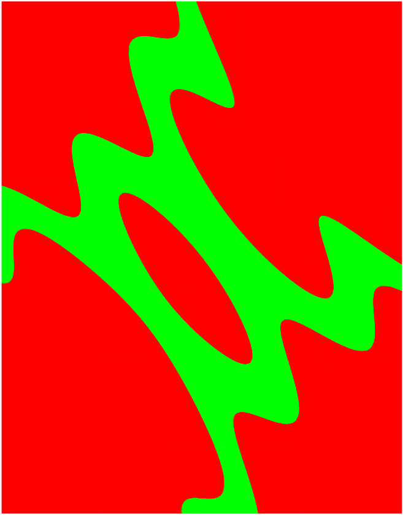

Do it Yourself!
================================

.. _Vibes: http://enstabretagnerobotics.github.io/VIBES/

In all the examples proposed below, we will display boxes (rectangles) to have a visual rendering of the computations. 

In the solutions, we propose to use `Vibes`_ but you can easily adapt the code to use your favorite graphical tool.

If you want to use Vibes alos, here is a few tips (valid for Linux and MacOS). 

First, install Vibes::

  gunzip  VIBES-XXX.tar.gz
  tar xvf VIBES-XXX.tar
  cd VIBES-XXX/viewer
  cmake .
  make 
  cd ../..
  
Vibes is based on a client-server approach, the boxes are sent by the client program through a pipe 
and plot by another program (the viewer). 

To run the viewer::

  VIBES-XXX/viewer/VIBes-viewer&

Now, copy the client API in the folder of your C++ program::

  cp VIBES-XXX/client-api/C++/src/* [my-folder]

In the client program, include the Vibes API:

.. code-block:: cpp

   #include "ibex.h"
   #include "vibes.cpp"

   using namespace std;
   using namespace ibex;

Then, connect to the server with the following instructions.

.. code-block:: cpp

   int main() {
     vibes::beginDrawing ();
     vibes::newFigure("....");
     ...

And disconnect before your program terminantes:

.. code-block:: cpp

   vibes::endDrawing();

Finally, to plot a box ([a,b],[c,d]) just call:

.. code-block:: cpp

   vibes::drawBox(a, b, c, d, "...");

What is between the double quotes is the color code of the box. For instance, "b[r]" will paint the box in red and the contour in blue.

Lab n°1: Set image
------------------

The complete code can be found here: ``examples/lab/lab1.cpp``.

**Introduction**

The goal of this first lab is to calculate the image of a box by a function using interval arithmetic:

If we denote by f the function and [x] the initial box, then the set S
to calculate is:

.. math::

   S := \{ f(x), x\in[x] \}.
   
Applying directly an :ref:`interval evaluation <tuto-func-eval>`
of the function f to [x] will give a single box that only represents an enclosure of S.

To fight with the wrapping effect, we will split [x] into smaller boxes and evaluate
the function with every little box as argument. This will result in a better description
of the set that will eventually converge to S as the size of the boxes tend to zero.

This will consist in three tasks:

- creating the function f
- creating the initial box [x] and splitting it into small boxes
- evaluating the function of every boxes
- plotting the results

**Question 1**

Create in the ``main`` the function

.. math::
   
   f:(x,y)\in\mathbb{R}^2\mapsto \begin{pmatrix}\sin(x+y)\\\cos(x+0.9\times y)\end{pmatrix}.
   
.. hidden-code-block:: cpp
   :label: show/hide solution
  
   Variable x,y;
   Function f(x,y,Return(sin(x+y),cos(x+0.9*y)));
		
**Question 2**

Create the box ([x],[y])=([0,6],[0,6]) and split each dimension into n slices, where n is a constant.

.. hidden-code-block:: cpp
   :label: show/hide solution

   IntervalVector box(2,Interval(0,6));

   // size of the "slice" on each dimension (x and y)
   double deltax=box[0].diam()/n;
   double deltay=box[1].diam()/n;

   for (int i=0; i<n; i++)
     for (int j=0; j<n; j++) {
       IntervalVector box2(2);
       box2[0]=Interval(box[0].lb()+i*deltax,box[0].lb()+(i+1)*deltax);
       box2[1]=Interval(box[1].lb()+j*deltay,box[1].lb()+(j+1)*deltay);
      
     }
   }
   
   
**Question 3**

Evaluate the function on each box and plot the result with Vibes.

.. hidden-code-block:: cpp
   :label: show/hide solution
   
   for ... 
     for ... {
       ...
       IntervalVector y=f.eval_vector(box2);
       // "b[b]" means that both the border and the interior of the box
       // is painted in blue
       vibes::drawBox(y[0].lb(), y[0].ub(), y[1].lb(), y[1].ub(), "b[b]");
     }
   }
   
   
**Question 4**

Compare the result with n=15, n=80 and n=500.

You should obtain the following pictures:

   +--------------------------+------------------------+--------------------------+
   | .. image:: lab1-15.png   | .. image:: lab1-80.png | .. image:: lab1-500.png  |
   |    :scale: 30%           |    :scale: 30%         |    :scale: 30%           |
   +--------------------------+------------------------+--------------------------+
   | n=15                     | n=80                   | n=500                    |
   +--------------------------+------------------------+--------------------------+
   

Lab n°2: Set inversion (basic)
----------------------------------

The complete code can be found here: ``examples/lab/lab2.cpp``.

**Introduction**

The goal of this lab is to program **Sivia** (*set inversion with interval analysis*) :ref:`[Jaulin & Walter 1993] <Jaulin93>` :ref:`[Jaulin 2001] <Jaulin01>`, an algorithm that draws a paving
representing a set E defined implicitely as the preimage of an interval [z] by a non-linear function :math:`f:\mathbb{R}^n\to\mathbb{R}` (here n=2).

.. math::
   E:=\{(x,y)\in\mathbb{R}^2, \ f(x,y)\in[z] \}.

.. figure:: sivia-basic.png
   :width: 300 px
   :align: center
   
   **Sivia (basic variant)**. *Result obtained with f(x,y)=sin(x+y)-0.1xy and [z]=[0,2], by simply alternating an evaluation and bisection phase. 
   For a precision of* :math:`\varepsilon=0.1`, *the number of boxes generated by the algorithm is* **11891**.

The Sivia algorithm performs a recursive exploration of the initial box by applying the following steps:

- **inner test**: if the image of ([x],[y]) by f is a subset of [z], the box is painted in green;

- **outer test**: if the image does not intersect [z], the box is painted in red;
  
- if none of these test succeeds and if ([x],[y]) has a maximal diameter greater than :math:`\varepsilon`, the box
  is split and the procedure is recursively called on the two subboxes.
  
**Question 1 (Initialisation)** 

Create the ``Function`` object that represents

.. math::
  (x,y)\mapsto \sin(x+y)-0.1\times x\times y.
  
and the initial bounding box ([-10,10],[-10,10]).

.. hidden-code-block:: cpp
   :label: show/hide solution

   	// Create the function we want to apply SIVIA on.
	Variable x,y;
	Function f(x,y,sin(x+y)-0.1*x*y);

	// Build the initial box
	IntervalVector box(2);
	box[0]=Interval(-10,10);
	box[1]=Interval(-10,10);

**Question 2 (Initialisation)** 

We shall use a `stack`_ for implementing the recursivity.
This stack is a container that will be used to store boxes.

Create a `C++ stack`_ and set the precision of bisection to 0.1.

Push the initial box in the stack. Define the image interval [z] and initialize it to [0,2].

.. _C++ stack: http://www.cplusplus.com/reference/stack/stack
.. _stack: http://en.wikipedia.org/wiki/Stack_%28abstract_data_type%29

.. hidden-code-block:: cpp
   :label: show/hide solution
   
   // Create a stack (for depth-first search)
   stack<IntervalVector> s;

   // Precision (boxes of size less than eps are not processed)
   double eps=0.1;

   // Push the initial box in the stack
   s.push(box);
   
   Interval z=Interval(0,2);

**Question 3**

Create the loop that pop boxes from the stack until it is empty.
Define a local variable ``box`` to be the current box (the one on top of the stack).

*Hint: use the top() and pop() functions of the* ``stack`` *class*.
  
.. hidden-code-block:: cpp
   :label: show/hide solution

   while (!s.empty()) {
     IntervalVector box=s.top();
     s.pop();
     ...
   }

**Question 4**

Implement the inner test (see above).
  
*Hint*: use :ref:`is_subset <itv-set-membership>`.

.. hidden-code-block:: cpp
   :label: show/hide solution

   while (!s.empty()) {
     IntervalVector box=s.top();
     s.pop();

     Interval fxy=f.eval(box);

     if (fxy.is_subset(z))
       vibes::drawBox(box[0].lb(), box[0].ub(), box[1].lb(), box[1].ub(), "k[g]");
     ...
   }
   
**Question 5**
 
Implement the outer test (see above).

*Hint*: use :ref:`intersects <itv-set-membership>`.

.. hidden-code-block:: cpp
   :label: show/hide solution

   while (!s.empty()) {
     ...
     else if (!fxy.intersects(z))
       vibes::drawBox(box[0].lb(), box[0].ub(), box[1].lb(), box[1].ub(), "k[r]");
     ...
   }
   
**Question 6**

If none of these test succeeds, split the box. We will split the box on the axis of its largest size.
Finally, the two subboxes are pushed on the stack.
  
*Hint*: use :ref:`extr_diam_index <itv-geom>` and :ref:`bisect <itv-bisect>`.

.. hidden-code-block:: cpp
   :label: show/hide solution

   while (!s.empty()) {
     ...  
     else if (box.max_diam()>eps) {
       // get the index of the dimension of maximal size (false stands for "max")
       int i=box.extr_diam_index(false);
       pair<IntervalVector,IntervalVector> p=box.bisect(i);
       s.push(p.first);
       s.push(p.second);
     }    
   }

Lab n°3: Set inversion (with contractors)
-------------------------------------------

The complete code can be found here: ``examples/lab/lab3.cpp``.

**Introduction**

We will improve the **Sivia** algorithm by replacing in the loop the inner and outer tests by contractions.
This leads to a more compact paving and a smaller number of boxes (see figure below).

The first part of the code is unchanged:

.. code-block:: cpp

   int main() {
     vibes::beginDrawing ();
     vibes::newFigure("lab3");

     // Create the function we want to apply SIVIA on.
     Variable x,y;
     Function f(x,y,sin(x+y)-0.1*x*y);

     // Build the initial box
     IntervalVector box(2);
     box[0]=Interval(-10,10);
     box[1]=Interval(-10,10);

     // Create a stack (for depth-first search)
     stack<IntervalVector> s;

     // Precision (boxes of size less than eps are not processed)
     double eps=0.1;

     // Push the initial box in the stack
     s.push(box);
     ...
     

The idea is to contract the current box either with respect to the constraint

.. math::
   f(x,y)\in[z],
   
in which case the contracted part will be painted in red, or

.. math::
   f(x)\not\in[z],

in which case the contracted part will be painted in green.

Given a contractor c, the contracted part is also called the *trace* of the contraction and is defined as :math:`[x]\backslash c([x])`.

   
   **Sivia (with contractors)**. *Result obtained with f(x,y)=sin(x+y)-0.1xy and [z]=[0,2].
   For a precision of* :math:`\varepsilon=0.1`, *the number of boxes generated by the algorithm is* **5165**.

**Question 1**

Build forward-backward contractors for the four constraints (see :ref:`the tutorial <tuto-fwd-bwd>`):

.. math::
   f(x)<0, \quad f(x)\ge0, \quad f(x)\le2 \quad \mbox{and} \quad f(x)>2.

.. hidden-code-block:: cpp
   :label: show/hide solution

   NumConstraint c1(x,y,f(x,y)<=2);
   NumConstraint c2(x,y,f(x,y)>=0);
   NumConstraint c3(x,y,f(x,y)>2);
   NumConstraint c4(x,y,f(x,y)<0);

   // Create contractors with respect to each
   // of the previous constraints.
   CtcFwdBwd out1(c1);
   CtcFwdBwd out2(c2);
   CtcFwdBwd in1(c3);
   CtcFwdBwd in2(c4);
	
**Question 2**

Thanks to the :ref:`composition <tuto-inter-union-compo>`, build a contractor w.r.t. :math:`f(x)\in[0,2]`.

Similarly, thanks to the union, build a contractor w.r.t. :math:`f(x)\not\in[0,2]`.

.. hidden-code-block:: cpp
   :label: show/hide solution

   // Create a contractor that removes all the points
   // that do not satisfy either f(x,y)<=2 or f(x,y)>=0.
   // These points are "outside" of the solution set.
   CtcCompo outside(out1,out2);

   // Create a contractor that removes all the points
   // that do not satisfy both f(x,y)>2 or f(x,y)<0.
   // These points are "inside" the solution set.
   CtcUnion inside(in1,in2);

**Question 3**

Create the function ``contract_and_draw`` with the following signature:

.. code-block:: cpp

   void contract_and_draw(Ctc& c, IntervalVector& box, const char* color);

This function must contract the box ``box`` in argument with the contractor ``c`` and plot the trace of the contraction (see above) with Vibes,
with the specified color ``color``.

*Hints: use the* :ref:`diff <itv-diff>` *function of* ``IntervalVector`` *to calculate the set difference between two boxes.*
 

.. hidden-code-block:: cpp
   :label: show/hide solution
   
   void contract_and_draw(Ctc& c, IntervalVector& box, const char* color) {

     // Variables used to calculate the "diff" between 2 boxes and store the result.
     IntervalVector savebox=box;
     IntervalVector *result;

     c.contract(box);

     int n=savebox.diff(box,result);

     for (int i=0; i<n; i++) {
       vibes::drawBox(result[i][0].lb(), result[i][0].ub(), result[i][1].lb(), result[i][1].ub(), color);
     }

     delete[] result;
   }
   
**Question 4**

Replace in the loop the inner/outer tests by contractions.

.. hidden-code-block:: cpp
   :label: show/hide solution
   
   while (!s.empty()) {
     IntervalVector box=s.top();
     s.pop();
     contract_and_draw(outside, box, "k[r]");
     contract_and_draw(inside, box, "k[g]");
     if (!box.is_empty() && box.max_diam()>eps) {
     	int i=box.extr_diam_index(false);
     	pair<IntervalVector,IntervalVector> p=box.bisect(i);
     	s.push(p.first);
     	s.push(p.second);
     }
   }

   
