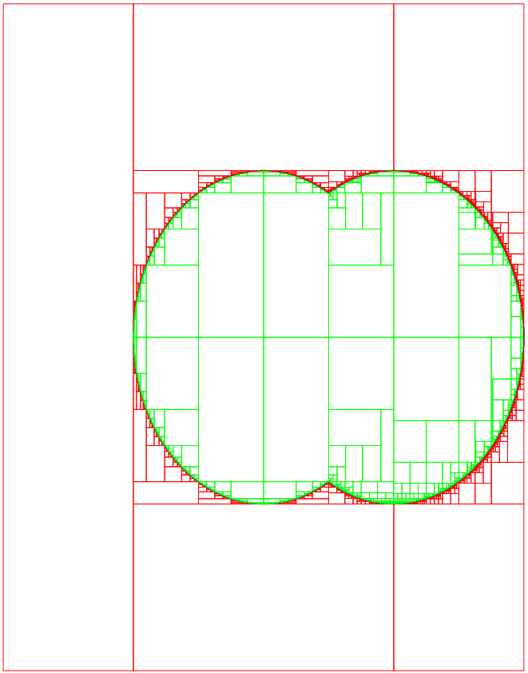

**************************************************
             Sets
**************************************************

.. _set:

------------------------------
Introduction
------------------------------

Ibex provides a structure for representing sets of :math:`\mathbb{R}^n` with boxes and performing operations on sets diretly.
Another possible name for such a set would be a *paving*.

**Note:** This part of the library is recent and under active development. It will be enriched with new functionalities
in future releases.

The structure is organized as a binary tree. Each leaf represents a box with a *status* that indicates whether
the box is inside the set, outside the set or potentially crossing the boundary of the set.
The status is a boolean interval (``BoolInterval``) which possible values are either ``YES`` (*inside*), ``NO`` (*outside*)
or ``MAYBE`` (*boundary*). This is depicted in the figure below:

.. figure:: set.png
   :width: 450 px
   :align: center
   
   
A set is an instance of ``Set`` and can either be initially defined as :math:`\mathbb{R}^n` itself or a specific box:

.. literalinclude:: ../examples/doc-separator.cpp    
   :language: cpp
   :start-after: set-init-C
   :end-before: set-init-C

------------------------------
File operations
------------------------------

You can save a set into a file and load a set from a file.

To save into a file named "set-example":

.. literalinclude:: ../examples/doc-separator.cpp    
   :language: cpp
   :start-after: set-save-C
   :end-before: set-save-C
   
To load a set from a file, use the constructor with string argument:

.. literalinclude:: ../examples/doc-separator.cpp    
   :language: cpp
   :start-after: set-load-C
   :end-before: set-load-C

.. _set-explore:

.. _lab_vibes:

---------------------------
A graphical tool: Vibes
---------------------------

.. _Vibes: http://enstabretagnerobotics.github.io/VIBES/

In all the examples proposed below, we will display boxes (rectangles) to have a visual rendering of the computations. 

In the solutions, we propose to use `Vibes`_ but you can easily adapt the code to use your favorite graphical tool.

If you want to use Vibes alos, here is a few tips (valid for Linux and MacOS). 

First, install Vibes::

  gunzip  VIBES-XXX.tar.gz
  tar xvf VIBES-XXX.tar
  cd VIBES-XXX/viewer
  cmake .
  make 
  cd ../..
  
Vibes is based on a client-server approach, the boxes are sent by the client program through a pipe 
and plot by another program (the viewer). 

To run the viewer::

  VIBES-XXX/viewer/VIBes-viewer&

Now, copy the client API in the folder of your C++ program::

  cp VIBES-XXX/client-api/C++/src/* [my-folder]

In the client program, include the Vibes API:

.. code-block:: cpp

   #include "ibex.h"
   #include "vibes.cpp"

   using namespace std;
   using namespace ibex;

Then, connect to the server with the following instructions.

.. code-block:: cpp

   int main() {
     vibes::beginDrawing ();
     vibes::newFigure("....");
     ...

And disconnect before your program terminantes:

.. code-block:: cpp

   vibes::endDrawing();

Finally, to plot a box ([a,b],[c,d]) just call:

.. code-block:: cpp

   vibes::drawBox(a, b, c, d, "...");

What is between the double quotes is the color code of the box. For instance, "b[r]" will paint the box in red and the contour in blue.

------------------------------
Exploring and plotting sets
------------------------------

The internal structure of sets is not intended to be handled directly by users (and may actually change with time).
If you want to explore a set, you can use the ``SetVisitor`` class (following the
`visitor design pattern`_) . This class must implement a ``visit_leaf``
function that will be automatically called for every leaf of the set (it can also optionnaly implement a ``visit_node``
function that is called for every intermediate node in the tree).

.. _visitor design pattern : http://en.wikipedia.org/wiki/Visitor_pattern

A typical usage of a set visitor is for listing or plotting the set and we shall illustrate the mechanism for such usage.

The ``visit_leaf`` function  must take in argument the information that characterizes a leaf, namely, a box (``IntervalVector``) and a status
(``BoolInterval``). Here is an example that simply dispaly the box and the status of a leaf in the standard output:

.. literalinclude:: ../examples/doc-separator.cpp    
   :language: cpp
   :start-after: set-visit-1-C
   :end-before: set-visit-1-C
   
Now the following code load a set from a file an list all the boxes inside:

.. literalinclude:: ../examples/doc-separator.cpp    
   :language: cpp
   :start-after: set-visit-2-C
   :end-before: set-visit-2-C
   
The result is:

+----------------------------------------------------------+--------------------------------------+
| .. literalinclude:: ../examples/doc-separator.txt        | .. figure:: set-visit.png            |
|   :start-after:  set-visit-2-O                           |    :width: 300 px                    |
|   :end-before:   set-visit-2-O                           |    :align: center                    |
+----------------------------------------------------------+--------------------------------------+
+  **Visiting the set with** ``ToPlot``                    | **Visiting the set with** ``ToVibes``|
+----------------------------------------------------------+--------------------------------------+

We will now show how to plot a set calculated by Ibex with :ref:`Vibes <lab_vibes>`.

We create a new class that implements the ``visit_leaf`` function as follows:

.. literalinclude:: ../examples/doc-separator.cpp    
   :language: cpp
   :start-after: set-visit-3-C
   :end-before: set-visit-3-C
   
The main code is similar:

.. literalinclude:: ../examples/doc-separator.cpp    
   :language: cpp
   :start-after: set-visit-4-C
   :end-before: set-visit-4-C
   
And the result is the picture above.

------------------------------
Intersection
------------------------------

A set can be intersected with another set that can either be explicit (of type ``Set``) or implicit.
A separator is an example of implicit set. In this case, the separator is recursively applied on
the set until some precision is reached (size of boundary boxes).

Let us first see intersection with a separator.
In the next example, we intersect the set [0,1]x[0,1] with a separator corresponding to the set
:math:`\|x\|\le 5`.

.. literalinclude:: ../examples/doc-separator.cpp    
   :language: cpp
   :start-after: set-sep-C
   :end-before: set-sep-C

The result is the following picture.

.. figure:: set-sep.png
   :width: 300 px
   :align: center

Now, the intersection between two sets is obtained with the ``&=`` operator.
In the next example, we create two sets from separators, one being a circle or radius 5, 
the other being the complementary of a circle of radius 4. The result of the intersection gives a ring.

.. literalinclude:: ../examples/doc-separator.cpp    
   :language: cpp
   :start-after: set-inter-C
   :end-before: set-inter-C

The result is the following picture.

.. figure:: set-inter.png
   :width: 300 px
   :align: center

**Note:** It should be emphasized that it is always better to handle sets explicitly on last resort.
This means that, in this example, it would have been more efficient to create one set from the intersection
of the two separators.
   
------------------------------
Union
------------------------------
The union works similarly. In the next example, we create two sets, one being a circle centered on the origin
and the other the circle centered on the point (5,0).
Then we perform the union of the two sets.

.. literalinclude:: ../examples/doc-separator.cpp    
   :language: cpp
   :start-after: set-union-C
   :end-before: set-union-C

The result is the following picture.

